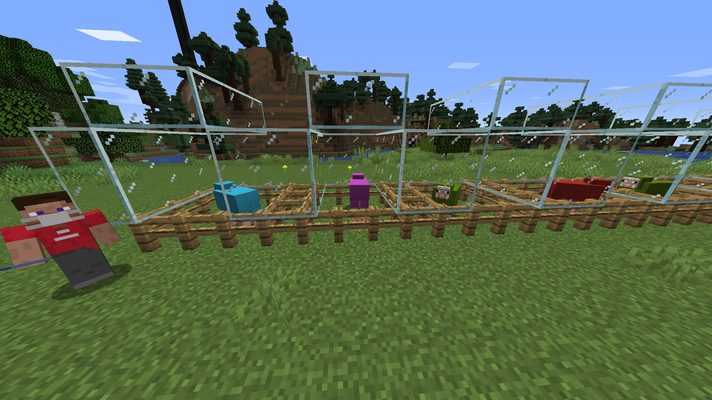
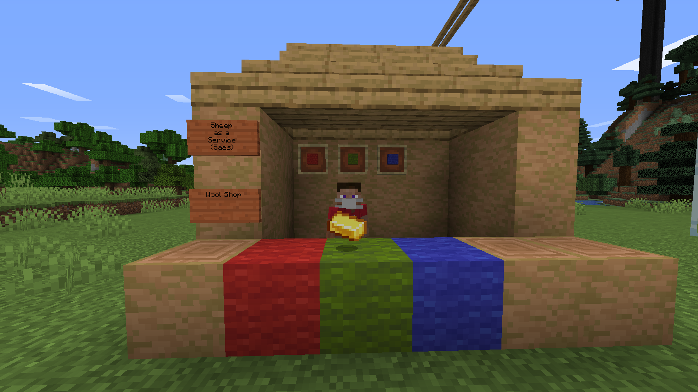
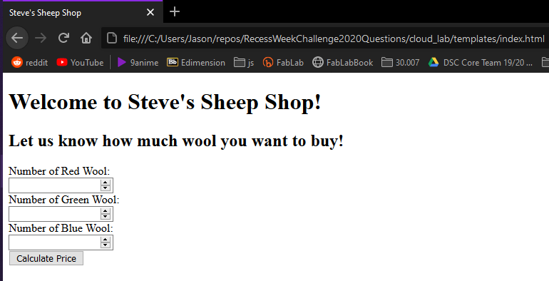
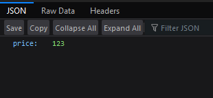
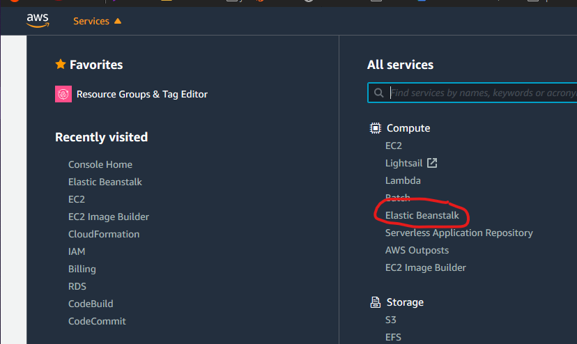
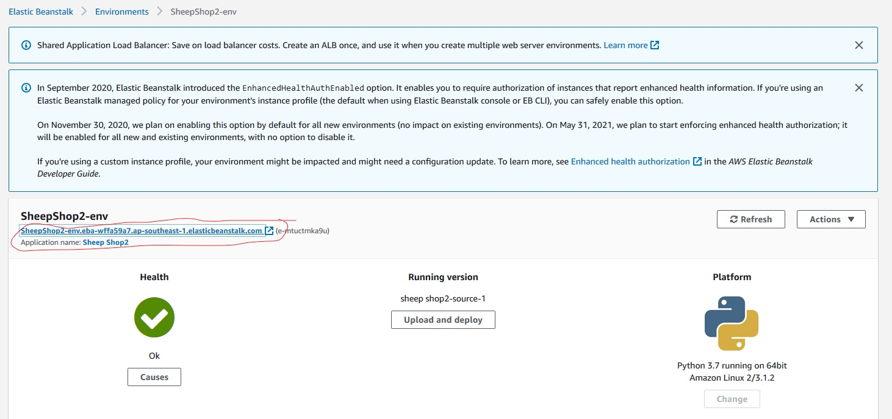

# Recess Week Challenge Cloud-Based Lab: Sheep-as-a-Service (SaaS)

## The story so far...

If you have tried out the teaser challenge released on Friday, you would have helped our main character, Steve to set up his sheep farm! 




Thanks to all your help, Steve is now happily shearing wool from his sheep! Now, Steve wants to sell wool to other Minecrafters. He needs your help to set up a system that helps customers calculate the price of the wool they wish to buy!



## Introduction

Welcome to 3DC's cloud-based lab! This lab has the following aims:

1. Create a web-app with a working backend API
2. The web-app will serve a very simple webpage as well that makes use of the backend API
3. Deploy the web-app onto the cloud.

TODO: Explain API

In this case, our backend API will return a response containing the total price of the wool that the requester requests for.

For this lab tutorial, we will be using [Flask](https://flask.palletsprojects.com/en/1.1.x/)(a Python backend framework). We will be deploying our app to ([Amazon Web Services(AWS)](https://aws.amazon.com/)) Elastic Beanstalk.

## Setting up your Local Environment

### Installing Python

Please refer to the [Python Website](https://www.python.org/) for instructions to install Python3 if you don't already have Python3 installed.

### Installing Flask

Open a Terminal/Command Prompt on your computer. (Here's an example for Windows)


Now, install Flask by typing the following into your command line. (Note: It might be `pip` or `pip3` on your computer depending on how you installed python)

```bash
pip install Flask
```

We now have Flask installed!

([Credits :Original Installation Instructions from Flask Website](https://flask.palletsprojects.com/en/1.1.x/installation/#python-version))


## Creating our first Flask Web Application!

For now, we will create a Flask Web Application that runs on our local machine first. We will deploy this application to the cloud later.

### Setting up the workspace

Let us start by creating a folder for our cloud lab. In this case I will name this folder `cloud_lab`.

We will create a Python file which will act as the source code for our Flask application. I will name this file `sheep_shop.py`, since this will be steve's sheep shop (or wool shop)!

We will also create a HTML file which will be our home webpage for Steve's Sheep Shop! Steve's customers will access this webpage to check the price of the wool they want to buy! I will be creating a new file called `index.html` and placing it under the `templates` folder inside our `cloud_lab` folder.

If you followed the steps above correctly, your directory structure should look like the following:

```
cloud_lab
|   sheep_shop.py
|
└───templates
    |   index.html
```

### Creating the webpage

> Since this tutorial is meant to be simple, we will only be using HTML, no CSS or Javascript

Open your empty `index.html` file using your favourite text editor (you can use Notepad). To make things simple, we have provided some very simple sample code with comments. Simply paste this code into your file and replace the fields the file tells you to replace.

```html
<!doctype html>
<html>
  <head>
    <!-- Fill in the title to appear as your tab title below -->
    <title>YOUR TITLE HERE</title>
  </head>
  <body>
    <!-- Fill in the main header title for your webpage below -->
    <h1>YOUR HEADER TITLE HERE</h1>

    <!-- Fill in the subtitle for your webpage below -->
    <h2>YOUR SUBTITLE HERE</h2>

    <!-- The below code adds a form to our webpage -->
    <!-- This form calls our Python file when the button is pressed -->
    <form id="request_form" action="{{ url_for('request_price') }}" method="POST">
    
      <!-- The <label> elements add labels for each field -->
      <!-- The <input> elements add fields for our forms -->
      <label for="num_red_wool">Number of Red Wool:</label><br>
      <input type="number" id="num_red_wool" name="num_red_wool"><br> 

      <label for="num_green_wool">Number of Green Wool:</label><br>
      <input type="number" id="num_green_wool" name="num_green_wool"><br>

      <label for="num_blue_wool">Number of Blue Wool:</label><br>
      <input type="number" id="num_blue_wool" name="num_blue_wool"><br>

      <!-- The below represents the submit button for our form -->
      <input type="submit" value="Calculate Price">
    </form> 
  </body>
</html>
```

Note that the `<input>` elements in the form have the `name` attribute assigned to them. This `name` attribute allows us to identify which field is which when we pass the form over to the Python code later on. In the `<form>` element, the `action` attribute causes the form to submit a [HTTP request](https://www.w3schools.com/tags/ref_httpmethods.asp) to our Python Flask Application (which acts as the server).

If you are interested to know, the `method` attribute specifies the kind of HTTP request that is sent to the server. A POST request is usually used to send data to a server.

Make sure to save your file! You can open this HTML file in your web browser to see what it looks like!



### Setting up the Local Flask Server

What we have just done is created a simple static webpage! However, the webpage by itself right now doesnt really do anything. It can't actually calculate anything!

Usually, you could simply add some javascript to add some interactive functionality to your webpage. However, we Steve realises he has a problem. The cost of each red wool, green wool and blue wool is changing all the time! Steve does not want to implement the logic for calculating the cost for the wool on his webpage. Instead, he wants to leave the calculation logic to a server, where he could also do many other things!

> Now of course, Steve's goal to calculate price is a very simple task, however, a server becomes much more important when you have databases and complicated logic involved. Static web pages by themselves are not made to handle complex server logic or concurrency.

Open `sheep_shop.py` in your favourite text editor(e.g. Notepad, VScode) or IDE (e.g. Spyder, PyCharm). Paste the following template code with comments into your Python file and replace the part to calculate the total wool price.

```python
from flask import Flask, render_template, request, jsonify

red_wool_price = 100    # Sets the price of a red wool to 100. DO NOT MODIFY
green_wool_price = 10   # Sets the price of a green wool to 10. DO NOT MODIFY
blue_wool_price = 1     # Sets the price of a green wool to 1. DO NOT MODIFY

app = Flask(__name__)   # Creates a Flask application

@app.route('/')    
def index():
    # When the user navigates to <your_site_url>/, the index.html page renders
    return render_template('index.html')

@app.route('/request_price', methods=['POST'])
def request_price():
    # The HTML page sends a HTTP request to this endpoint
    # containing the wool numbers that the customer keyed in
    # Now we extract the actual wool numbers from the HTTP request.
    num_red_wool = int(request.form.get('num_red_wool'))
    num_green_wool = int(request.form.get('num_green_wool'))
    num_blue_wool = int(request.form.get('num_blue_wool'))

    # Replace the 0 with the logic to calulcate the total price of the wools
    # Hint: Total price is given by the sum of the number of each type of wool
    # multiplied by their individual price. The variables containig the price of 
    # each wool has already been provided at the start of this file
    price = 0

    # Now we return a JSON object containing the price of the object
    # as a reponse
    return jsonify({ 'price': price })

if __name__ == '__main__':
    app.run()
```

Basically, the Flask app shows the user the webpage when the user navigates to the root directory of the website.

In the second part of the flask app, there is a HTTP endpoint (you can think of it like a function) that handles the submitted form data from our `index.html` webpage. If you recall from the HTML file, we had a line

```html
    <form id="request_form" action="{{ url_for('request_price') }}" method="POST">
```

This `action` attribute tells the form to send the form data to the the url of the function with the name `request_price` in our flask app. The `request_price` function then takes the form data containing the number of wools, calculates the total price and returns a JSON object containing this total price in its response.

### Running the Local Flask Server

To start up the server, open up a terminal, and [navigate](https://www.howtogeek.com/659411/how-to-change-directories-in-command-prompt-on-windows-10/) to the `cloud_lab` directory. Simply start the server by typing in the terminal (warning: depending on your setup, the command may be `python3` instead of `python`)

```bash
python sheep_shop.py
```

You should see output on the terminal similar to the following:

```
 * Serving Flask app "sheep_shop" (lazy loading)
 * Environment: production
   WARNING: This is a development server. Do not use it in a production deployment.
   Use a production WSGI server instead.
 * Debug mode: off
 * Running on http://127.0.0.1:5000/ (Press CTRL+C to quit)
```

Great, our flask app is now running! In your web browser, navigate to the url stated in the terminal output (usually `http://127.0.0.1:5000/`), and you should see your main webpage again, but this time served from your local Flask server!

We can test out our webpage and price calculation. For example, fill in the number of the red, green and blue wools to be 1, 2 and 3 respectively, then click on the calculate button. You should now be redirected to another page that looks like this:

On Firefox:



On Chrome/Edge:


Congratulations, you have created your first working Flask application with a webpage and HTTP endpoint! Let us see how we can deploy this application to the cloud so the anyone on the internet case access it! (and so we can award you marks for your lab)

## Deploying a Flask Web Application to the Cloud (AWS)

We will be deploying our Flask server to AWS Elastic Beanstalk, a managed cloud service that will help to host the Flask application for us. Note that the options we choose in this lab should not incur any monetary costs, as we are using the 'free tier' of services.

### 0. Prepare our application

To upload to Elastic Beanstalk, we need to do some additional configurations and setup.

First, Elastic Beanstalk requires our Python Flask file to be called `application.py`, so go ahead rename that file. The name of the Flask app variable in our Python file also needs to be called `application`, so go ahead and replace ALL occurances of `app` with `application`.

> IMPORTANT: Be careful! You need to change the `app.route` to `application.route` and the `app.run()` to `application.run()`

Second, Elastic Beanstalk requires a `requirements.txt` in the same folder as the `application.py`, so that it knows what dependencies it needs to install. Normally, we would use `pip freeze` to help us find out the requirements of our virtual environment. However, since we did not create virtual environment, this would just return all the dependencies installed on our computer, instead of just the ones required for the Flask Application. So, create a new file called `requirements.txt` and paste the contents inside:

```txt
click==7.1.2
Flask==1.1.2
itsdangerous==1.1.0
Jinja2==2.11.2
MarkupSafe==1.1.1
Werkzeug==1.0.1
```

We will need to zip our application to upload to AWS later. There are other ways to upload our application, e.g. using S3 or Github, but we will just zip the application for now. (I will zip the contents `cloud_lab` folder to `cloud_lab.zip`)

> IMPORTANT: Make sure there is no extra base folder in your zip file. The moment you open the zip file, the Python file and requirements file and templates folder should be in the root directory.

### 1. Create an AWS Account

If you do not have an AWS Account already, sign up for a free AWS account here:
https://aws.amazon.com/. If you have an account, just log in.

### 2. Go to the AWS Elastic Beanstalk Console

In the AWS Management Console, click on `Services` in the top left corner, and click on `Elastic Beanstalk`.



Then, click on `Create Application`


### 3. Fill in Application Details

You should now see a form to fill in your application details.

Fill in the following:

1. For `Application Name`, just fill in whatever you want (e.g. `Sheep Shop`)
2. Leave `Application Tags` empty
3. For `Platform`, choose `Python`, then `Python3.7 running on 64bit Amazon Linux 2` for the Platform branch, then `3.1.2` for the platform version (or which is given)
4. For `Application Code`, choose to upload your code.
5. For `Source Code Origin`, choose `Choose file`, then choose to upload the zip file we created for our application earlier (e.g. `cloud_lab.zip`).
6. For `Application code tags`, leave it alone, then click on `Create Application`

### 4. Wait for Application Deployment

You should now see something like this.


AWS Elastic Beanstalk is now deploying your application, give it a while for it to be ready. Meanwhile, go make yourself some coffee or something!

After some time, the deployment should be complete, and you should see the following:



To verify the webpage is indeed working, navigate to the link (as circled in the image). You should see your working webpage. Try calculating the price of wools, and it should be working!

### 5. You're Done!

That wasn't so difficult was it? Deploying your first web application onto the cloud.

Once you're ready, [submit your cloud based lab here](https://3dc-recess-week-web.azurewebsites.net/).

We strongly encourage you to explore other options for creating a web-app (e.g. Express/Spring/ASP.NET/Django), as well as the other cloud providers (E.g. Microsoft Azure, Google Cloud Platform) and the different services they have to offer!