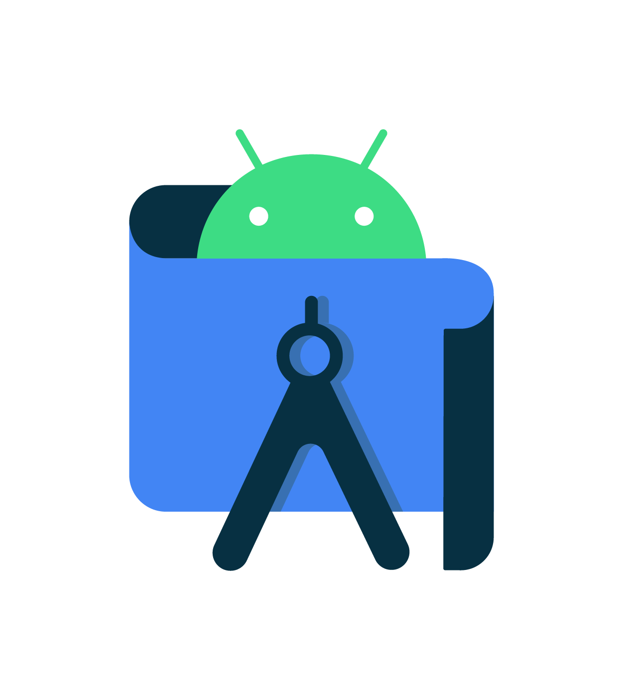
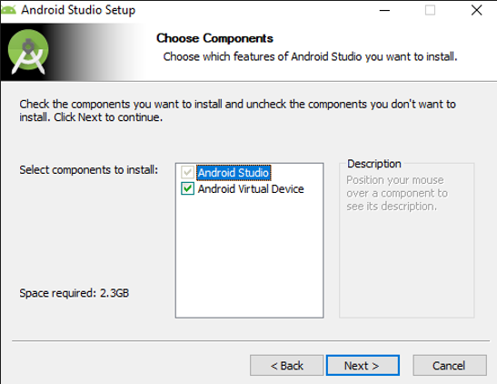
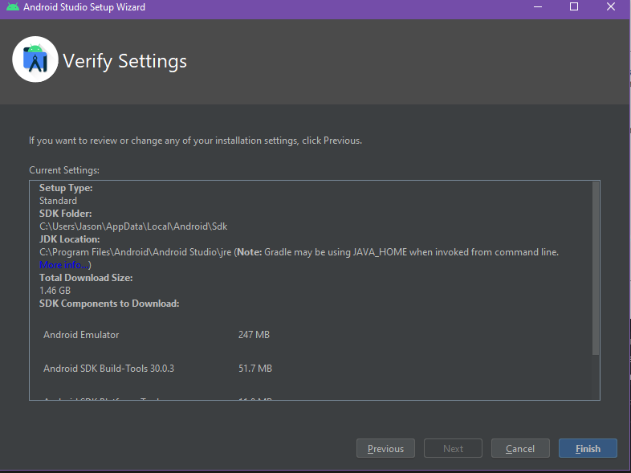

# Day 0: Environment Setup

## Installing Android Studio (What's that?)

> Please go through this document before coming for the workshop! Note that you may need to free up about 10GB worth of space for this workshop. We also recommend using a computer with at least 8GB of RAM

{: style="height:200px;width:200px"}

The main piece of software we will be using for this workshop will be Android Studio! Android Studio is an [IDE (Integrated Development Environment)](https://en.wikipedia.org/wiki/Integrated_development_environment) used for developing Android applications.

[Download Android Studio here!](https://developer.android.com/studio) Android Studio is available for all major operating systems, including Windows, Mac and Linux.

> Note: If you have [IntelliJ IDEA](https://www.jetbrains.com/idea/) installed already, you can use that instead of Android Studio. IntelliJ IDEA and Android Studio are nearly identical for Android Development (because Android Studio is mostly just a rebrand of IntelliJ IDEA).

Go ahead and run the installer and follow the instructions. When you encounter the *choose components* screen, make sure **Android Virtual Device** is selected. 

> Hold up, whats Android Virtual Device? **Android Virtual Device (AVD)** is basically an virtual Android Device that allows you to run an Android Phone on your computer! It allows you to test your Android Applications easily, even without a physical Android device! Neat huh?

Once we're finished installing, let's proceed to the first time setup of Android Studio!

## Android Studio first time Setup

Android Studio has been installed, but it still needs to download some dependencies, such as the Android SDK(Software Development Kit) and JDK(Java Development Kit). Open up Android Studio, which should prompt you with a Setup Wizard. We recommend selecting **Standard** as your installation type. Just follow the instructions and the Setup Wizard should start downloading your components for you!

We're done installing! 

Let's proceed with the Java tutorial!(For those who have never touched Java before)