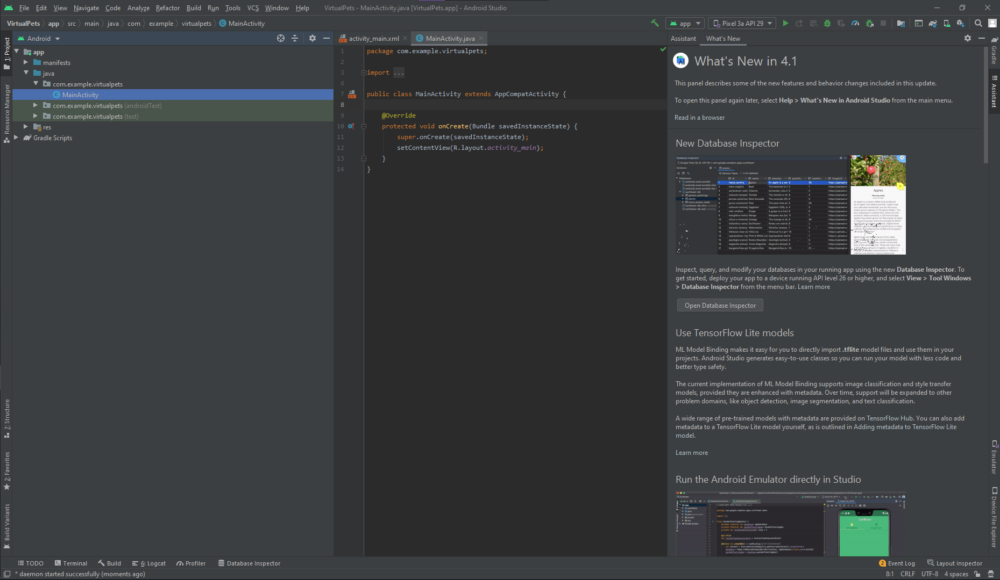
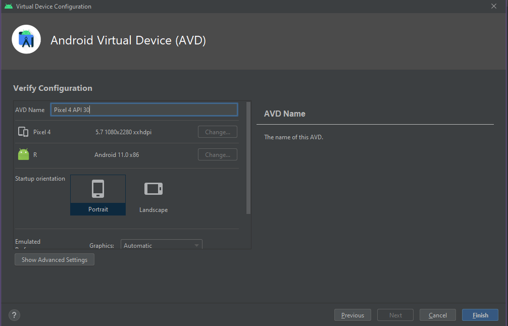
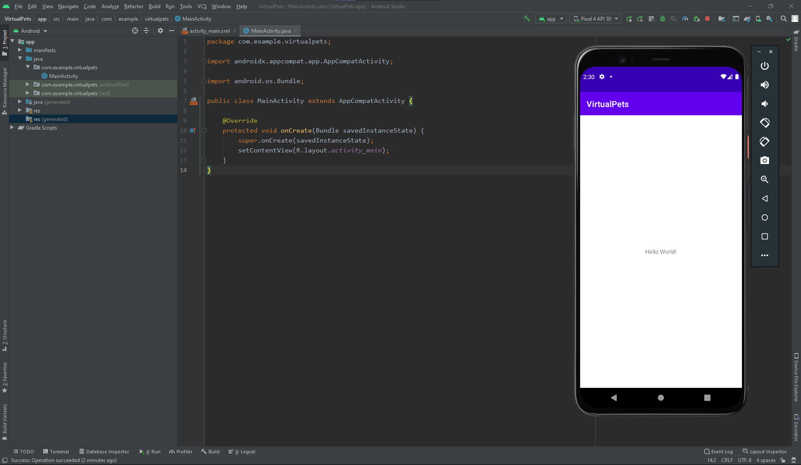
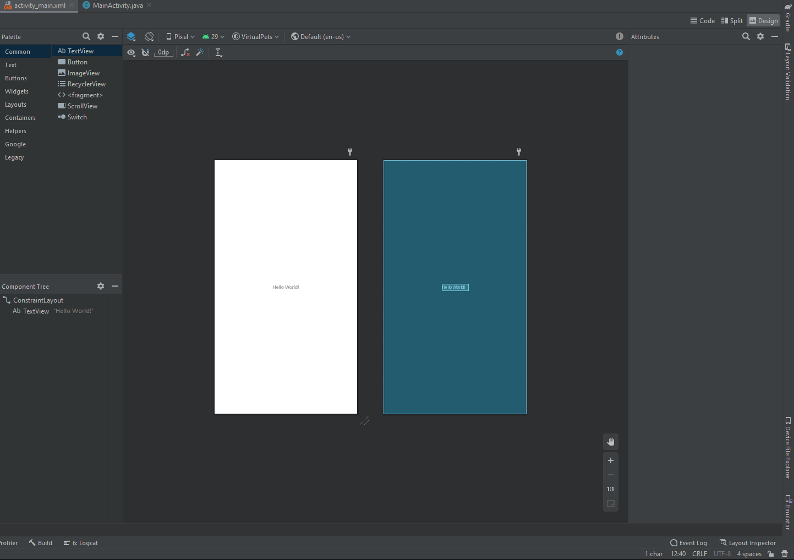
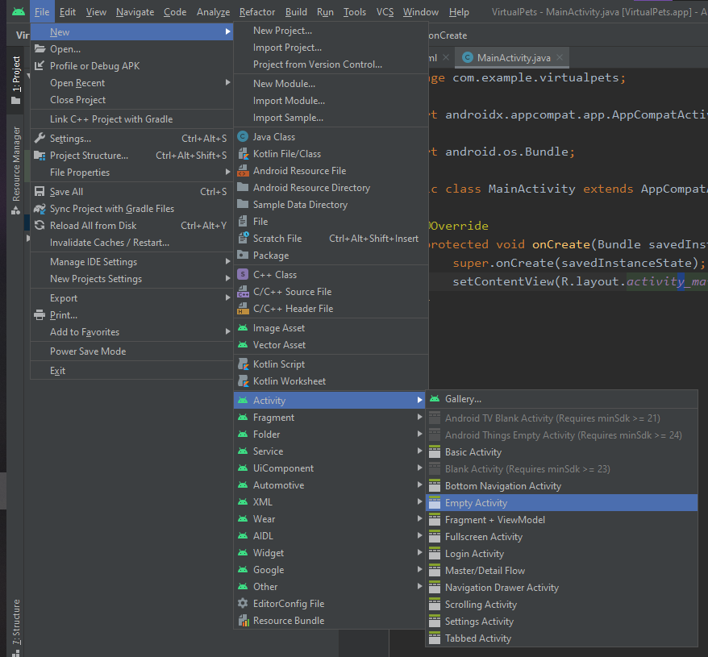
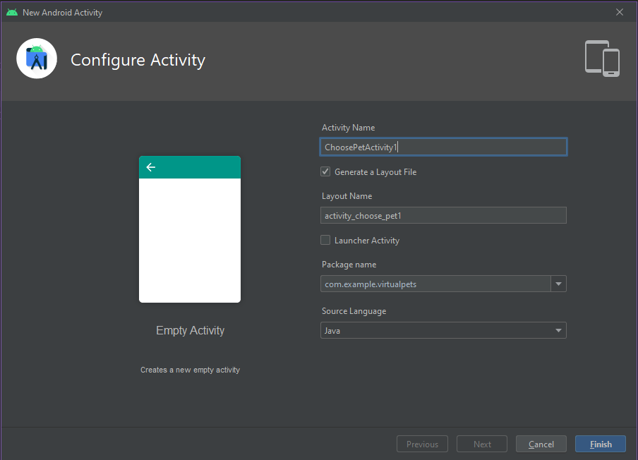
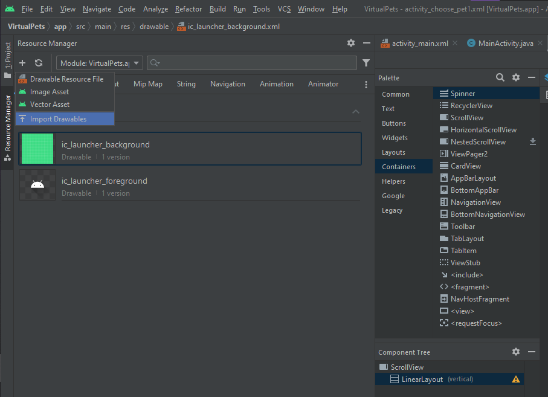
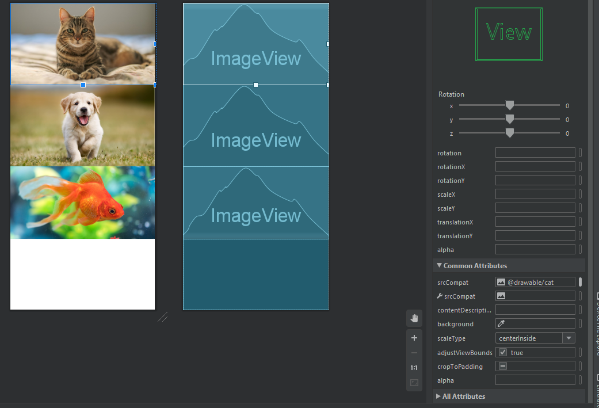
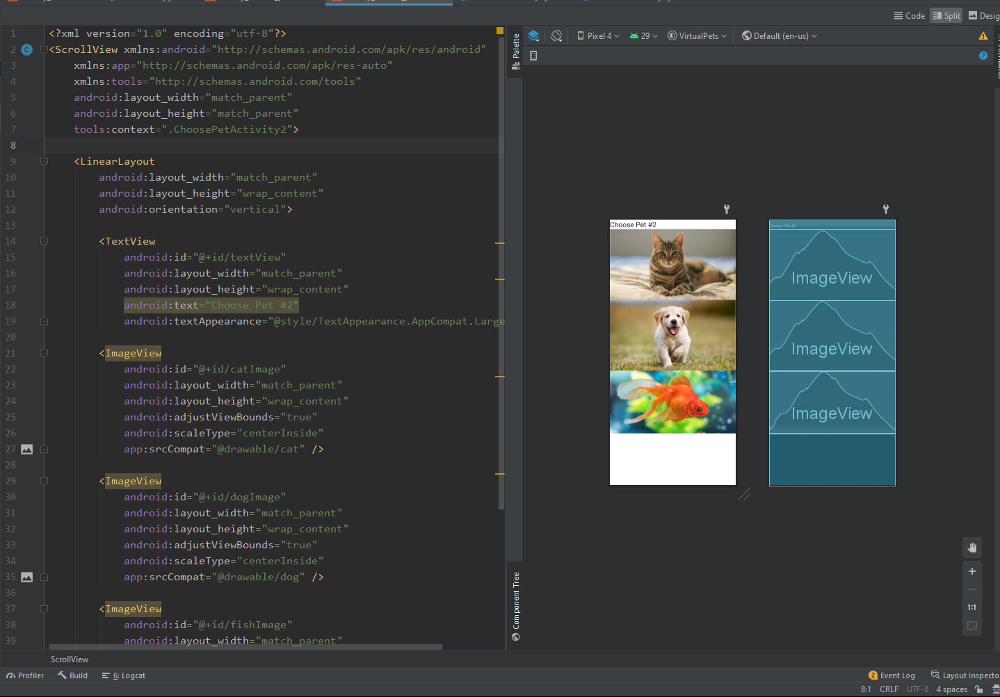

# Day 1:

Home


Black Activity Template


Options, choose Java


Wait awhile, bottom should show some processes running on startup. When done, screen looks like this.



Tell them to dismiss the whats new panel, introduce to them the ui.
- Left panel is files view. Tell them how to switch between `Android` and `Project` and explain differences. Last year's IAP has explanation for all this, can refer to it
- Top right is for running. Talk about play button and the virtual device thing.
- Middle is obviously editing area
- bottom left is tools like logcat


Try running app now to check if its working. I have setup instructions from last year, can refer to those. But on stream should go through the virtual device setup.


Tell them to donwload a release (probably latest) and click next. About 1.1GB, takes like quite a few mins. Give ppl buffer time/break here to set stuff up, or can use this to answer questions. Can explain the android folder structure on the left (what does manifest do, how java activity works (oncreate etc), inflates a xml layout file), ctrl click to get to xml




Run bar


After launching



======

Explain the GUI to them. Left bottom area, left top, right area.



Explain constraintlayout.
Change textview to button


Alternative code method, from

```xml
<TextView
    android:layout_width="wrap_content"
    android:layout_height="wrap_content"
    android:text="Hello World!"
    app:layout_constraintBottom_toBottomOf="parent"
    app:layout_constraintLeft_toLeftOf="parent"
    app:layout_constraintRight_toRightOf="parent"
    app:layout_constraintTop_toTopOf="parent" />
```

to 

```xml
<Button
    android:layout_width="wrap_content"
    android:layout_height="wrap_content"
    android:text="Start!"
    app:layout_constraintBottom_toBottomOf="parent"
    app:layout_constraintLeft_toLeftOf="parent"
    app:layout_constraintRight_toRightOf="parent"
    app:layout_constraintTop_toTopOf="parent" />
```

Assign id to start button


Code looks like that

```xml
<?xml version="1.0" encoding="utf-8"?>
<androidx.constraintlayout.widget.ConstraintLayout xmlns:android="http://schemas.android.com/apk/res/android"
    xmlns:app="http://schemas.android.com/apk/res-auto"
    xmlns:tools="http://schemas.android.com/tools"
    android:layout_width="match_parent"
    android:layout_height="match_parent"
    tools:context=".MainActivity">

    <Button
        android:id="@+id/startButton"
        android:layout_width="wrap_content"
        android:layout_height="wrap_content"
        android:text="Start!"
        app:layout_constraintBottom_toBottomOf="parent"
        app:layout_constraintLeft_toLeftOf="parent"
        app:layout_constraintRight_toRightOf="parent"
        app:layout_constraintTop_toTopOf="parent" />

</androidx.constraintlayout.widget.ConstraintLayout>
```

Result (Go test or something)


Create new activity (or new page)





Convert to ScrollView (type it in, explain scrollview, you may want to add more stuff than 3 imageviews to actually show the scrolling)


Add Linear Layout inside ScrollView


Import Images into Android Studio. 

Download images first

Open resource manager and import drawables



Import all images with import more files.


Can see images now in the resource manager

Go widgets drag ImageView into linearlayout.


Choose Image


Images are too tall, need to set `scaleType` to `centerInside` and `adjustViewBounds` to `true`.



We will need to get reference to each image in Java file later. Tell them to set a easily representative image id.


Add title to the page, textview


Create another activity called `ChoosePetActivity2`, copy the code from the first xml to the next, change `tools:context` to `.ChoosePetActivity2`, change title text to `Choose Pet #2`.



Create activity called `MyPetActivity` to display the 2 pets.

Convert root layout to `LinearLayout`

Change from horizontal to vertical

Add two linear layouts

Each linear layout, add 1 imageView, one textview, one button

Set some size for imageview, remember also the centerinside and adjustviewbounds

Rename all the ids


## Java Part

In `MainActivity.java` inside `onCreate` function add reference to button (tell them to use alt-enter to import)

```java
Button button = findViewById(R.id.startButton);
```

Then add a click listener.

```java
button.setOnClickListener(new View.OnClickListener() {
    @Override
    public void onClick(View view) {
        
    }
});
```

Talk about intents, going to new activity

```java
Intent intent = new Intent(getApplicationContext(), ChoosePetActivity1.class);
startActivity(intent);
```

<details>
  <summary>Final Code of MainActivity.java</summary>

```java
package com.example.virtualpets;

import androidx.appcompat.app.AppCompatActivity;

import android.content.Intent;
import android.os.Bundle;
import android.view.View;
import android.widget.Button;

public class MainActivity extends AppCompatActivity {

    @Override
    protected void onCreate(Bundle savedInstanceState) {
        super.onCreate(savedInstanceState);
        setContentView(R.layout.activity_main);

        Button button = findViewById(R.id.startButton);

        button.setOnClickListener(new View.OnClickListener() {
            @Override
            public void onClick(View view) {
                Intent intent = new Intent(MainActivity.this, ChoosePetActivity1.class);
                startActivity(intent);
            }
        });
    }
}
```

</details>

For `ChoosePetActivity1`,

Set references to images

```java
ImageView catImage = findViewById(R.id.catImage);
ImageView dogImage = findViewById(R.id.dogImage);
ImageView fishImage = findViewById(R.id.fishImage);
```

Get reference to SharedPreferences (explain what this is), so that we can save the information about Pet Chosen

```java
SharedPreferences sharedPref = getSharedPreferences(getString(R.string.preference_file_key), Context.MODE_PRIVATE);
```

Create a convenience function to go next activity, below onCreate. (Can consider simplifying this, just copy this code instead of writing function)

```java
private void goNextActivity() {
    Intent intent = new Intent(this, ChoosePetActivity2.class);
    startActivity(intent);
}
```

Inside oncreate, Set onclicklisteners (explain what this is), write to sharedpreference to save the pet choice, then go next activity.

```java
catImage.setOnClickListener(view -> {
    sharedPref.edit().putString("pet1", "cat").apply();
    goNextActivity();
});

dogImage.setOnClickListener(view -> {
    sharedPref.edit().putString("pet1", "dog").apply();
    goNextActivity();
});

fishImage.setOnClickListener(view -> {
    sharedPref.edit().putString("pet1", "fish").apply();
    goNextActivity();
});
```

<details>
  <summary>Final code for ChoosePetsActivity1.java looks like this</summary>

```java
package com.example.virtualpets;

import androidx.appcompat.app.AppCompatActivity;

import android.content.Context;
import android.content.Intent;
import android.content.SharedPreferences;
import android.os.Bundle;
import android.view.View;
import android.widget.ImageView;

public class ChoosePetActivity1 extends AppCompatActivity {

    @Override
    protected void onCreate(Bundle savedInstanceState) {
        super.onCreate(savedInstanceState);
        setContentView(R.layout.activity_choose_pet1);

        // Set references to Images
        ImageView catImage = findViewById(R.id.catImage);
        ImageView dogImage = findViewById(R.id.dogImage);
        ImageView fishImage = findViewById(R.id.fishImage);

        // Get a reference to SharedPreferences
        SharedPreferences sharedPref = getSharedPreferences(getString(R.string.preference_file_key), Context.MODE_PRIVATE);

        catImage.setOnClickListener(view -> {
            sharedPref.edit().putString("pet1", "cat").apply();
            goNextActivity();
        });

        dogImage.setOnClickListener(view -> {
            sharedPref.edit().putString("pet1", "dog").apply();
            goNextActivity();
        });

        fishImage.setOnClickListener(view -> {
            sharedPref.edit().putString("pet1", "fish").apply();
            goNextActivity();
        });


    }

    private void goNextActivity() {
        Intent intent = new Intent(this, ChoosePetActivity2.class);
        startActivity(intent);
    }
}
```

</details>


Do the same for the ChoosePetActivity2, but change `pet1` to `pet2`, and modify goNexTActivity.

<details>
  <summary>Final code for ChoosePetActivity2</summary>
  
```java
package com.example.virtualpets;

import androidx.appcompat.app.AppCompatActivity;

import android.content.Context;
import android.content.Intent;
import android.content.SharedPreferences;
import android.os.Bundle;
import android.widget.ImageView;

public class ChoosePetActivity2 extends AppCompatActivity {

    @Override
    protected void onCreate(Bundle savedInstanceState) {
        super.onCreate(savedInstanceState);
        setContentView(R.layout.activity_choose_pet2);

        // Set references to Images
        ImageView catImage = findViewById(R.id.catImage);
        ImageView dogImage = findViewById(R.id.dogImage);
        ImageView fishImage = findViewById(R.id.fishImage);

        // Get a reference to SharedPreferences
        SharedPreferences sharedPref = getSharedPreferences(getString(R.string.preference_file_key), Context.MODE_PRIVATE);

        catImage.setOnClickListener(view -> {
            sharedPref.edit().putString("pet2", "cat").apply();
            goNextActivity();
        });

        dogImage.setOnClickListener(view -> {
            sharedPref.edit().putString("pet2", "dog").apply();
            goNextActivity();
        });

        fishImage.setOnClickListener(view -> {
            sharedPref.edit().putString("pet2", "fish").apply();
            goNextActivity();
        });


    }

    private void goNextActivity() {
        Intent intent = new Intent(this, MyPetActivity.class);
        startActivity(intent);
    }
}
```

</details>

For `MyPetActivity`,

Same stuff, get reference to views first.

```java
ImageView pet1Image = findViewById(R.id.pet1Image);
TextView pet1HungerText = findViewById(R.id.pet1HungerText);
Button pet1Button = findViewById(R.id.pet1Button);

ImageView pet2Image = findViewById(R.id.pet2Image);
TextView pet2HungerText = findViewById(R.id.pet2HungerText);
Button pet2Button = findViewById(R.id.pet2Button);
```

Then get the sharedpreferences, we will need to read the pets from it. Explain how the getstring works

```java
// Get copy of sharedpreferences
SharedPreferences sharedPref = getSharedPreferences(getString(R.string.preference_file_key), Context.MODE_PRIVATE);

// Get Pet1, default to cat
String pet1 = sharedPref.getString("pet1", "cat");

// Get Pet2, default to dog
String pet2 = sharedPref.getString("pet2", "dog");
```

Write a convenience function to initialise the widgets for each pet.

```java
private void initialiseWidgetsForPet(ImageView petImage, TextView hungerText,
                                      Button petButton, String pet) {
    // This function runs for each pet we have

    // Set the image based on which pet it is
    if (pet.equals("cat")) {
        petImage.setImageResource(R.drawable.cat);
    } else if (pet.equals("dog")) {
        petImage.setImageResource(R.drawable.dog);
    } else {    // Else it probably is a fish
        petImage.setImageResource(R.drawable.fish);
    }

    // Set the hungerText to 100 at first
    hungerText.setText(Integer.toString(100));

    // Set onclicklistener to increment hunger by 1 for each button click
    petButton.setOnClickListener(view -> {
        int oldHunger = Integer.parseInt(hungerText.getText().toString());
        hungerText.setText(Integer.toString(oldHunger + 1));
    });
}
```

Add the call to the convenience function at oncreate.

```java
initialiseWidgetsForPet(pet1Image, pet1HungerText, pet1Button, pet1);
initialiseWidgetsForPet(pet2Image, pet2HungerText, pet2Button, pet2);
```

<details>
  <summary>Final code for MyPetActivity.java</summary>

```java
package com.example.virtualpets;

import androidx.appcompat.app.AppCompatActivity;

import android.content.Context;
import android.content.SharedPreferences;
import android.os.Bundle;
import android.widget.Button;
import android.widget.ImageView;
import android.widget.TextView;

public class MyPetActivity extends AppCompatActivity {

    @Override
    protected void onCreate(Bundle savedInstanceState) {
        super.onCreate(savedInstanceState);
        setContentView(R.layout.activity_my_pet);

        // Set references to widgets in layout file
        ImageView pet1Image = findViewById(R.id.pet1Image);
        TextView pet1HungerText = findViewById(R.id.pet1HungerText);
        Button pet1Button = findViewById(R.id.pet1Button);

        ImageView pet2Image = findViewById(R.id.pet2Image);
        TextView pet2HungerText = findViewById(R.id.pet2HungerText);
        Button pet2Button = findViewById(R.id.pet2Button);

        // Get copy of sharedpreferences
        SharedPreferences sharedPref = getSharedPreferences(getString(R.string.preference_file_key), Context.MODE_PRIVATE);

        // Get Pet1, default to cat
        String pet1 = sharedPref.getString("pet1", "cat");

        // Get Pet2, default to dog
        String pet2 = sharedPref.getString("pet2", "dog");

        initialiseWidgetsForPet(pet1Image, pet1HungerText, pet1Button, pet1);
        initialiseWidgetsForPet(pet2Image, pet2HungerText, pet2Button, pet2);
    }

    private void initialiseWidgetsForPet(ImageView petImage, TextView hungerText,
                                         Button petButton, String pet) {
        // This function runs for each pet we have

        // Set the image based on which pet it is
        if (pet.equals("cat")) {
            petImage.setImageResource(R.drawable.cat);
        } else if (pet.equals("dog")) {
            petImage.setImageResource(R.drawable.dog);
        } else {    // Else it probably is a fish
            petImage.setImageResource(R.drawable.fish);
        }

        // Set the hungerText to 100 at first
        hungerText.setText(Integer.toString(100));

        // Set onclicklistener to increment hunger by 1 for each button click
        petButton.setOnClickListener(view -> {
            int oldHunger = Integer.parseInt(hungerText.getText().toString());
            hungerText.setText(Integer.toString(oldHunger + 1));
        });
    }
}
```

</details>