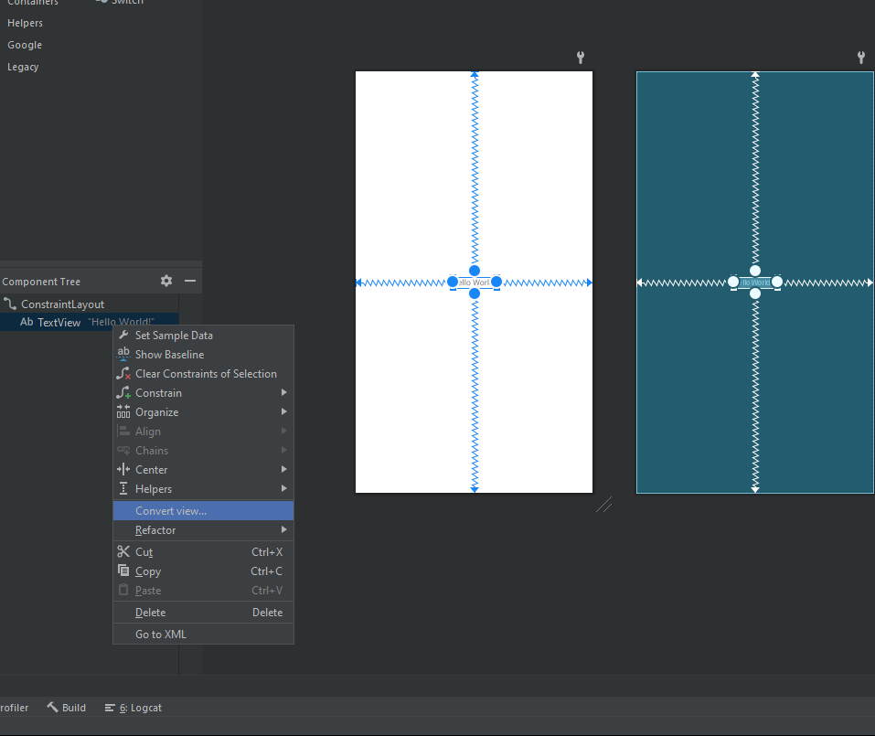
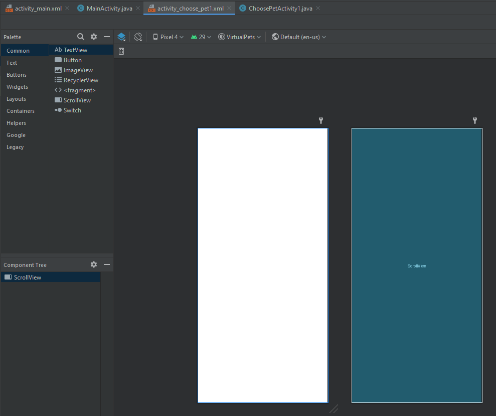
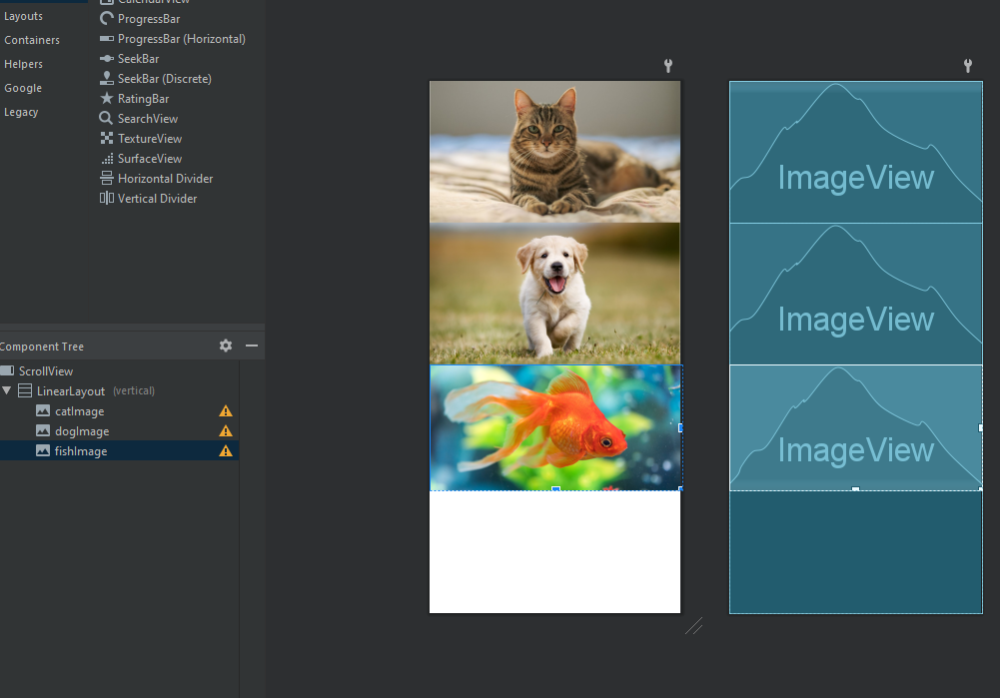
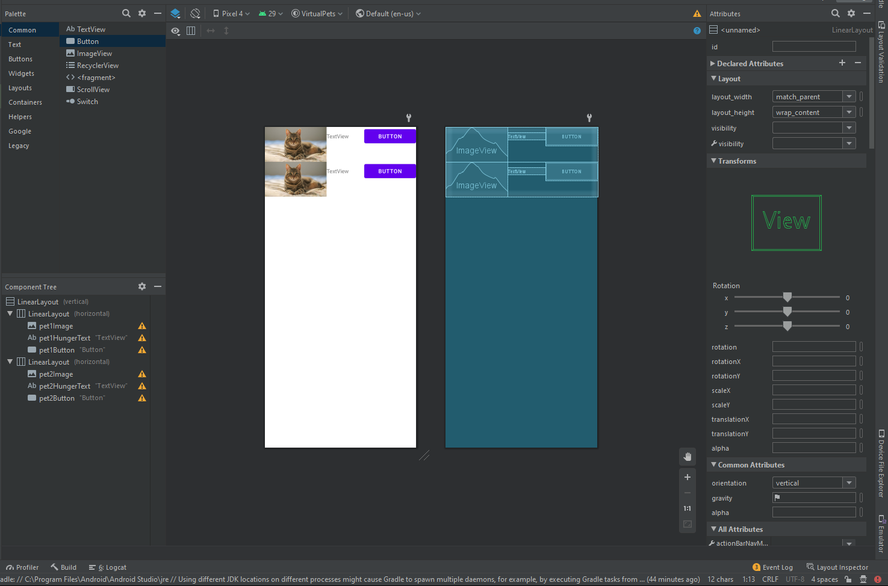

# Day 1:

## Start Page 

Now, we move onto the GUI, the place where you are going to arrange the layout of your app. This workshop will touch on the UI Designer method, but you can choose to code it out in the XML file directly too. 


Layouts are how we will be arranging our elements. Here, we use constraintlayout which will automatically organize for us the spacing depending on the constraints we set (already done by default). 
Try changing the textView "Hello World" to a start button, and see how it changes in the XML code. 




Alternative code method, from

```xml
<TextView
    android:layout_width="wrap_content"
    android:layout_height="wrap_content"
    android:text="Hello World!"
    app:layout_constraintBottom_toBottomOf="parent"
    app:layout_constraintLeft_toLeftOf="parent"
    app:layout_constraintRight_toRightOf="parent"
    app:layout_constraintTop_toTopOf="parent" />
```

to 

```xml
<Button
    android:layout_width="wrap_content"
    android:layout_height="wrap_content"
    android:text="Start!"
    app:layout_constraintBottom_toBottomOf="parent"
    app:layout_constraintLeft_toLeftOf="parent"
    app:layout_constraintRight_toRightOf="parent"
    app:layout_constraintTop_toTopOf="parent" />
```

All elements need an id: Assign id to the start button


Code looks like that

```xml
<?xml version="1.0" encoding="utf-8"?>
<androidx.constraintlayout.widget.ConstraintLayout xmlns:android="http://schemas.android.com/apk/res/android"
    xmlns:app="http://schemas.android.com/apk/res-auto"
    xmlns:tools="http://schemas.android.com/tools"
    android:layout_width="match_parent"
    android:layout_height="match_parent"
    tools:context=".MainActivity">

    <Button
        android:id="@+id/startButton"
        android:layout_width="wrap_content"
        android:layout_height="wrap_content"
        android:text="Start!"
        app:layout_constraintBottom_toBottomOf="parent"
        app:layout_constraintLeft_toLeftOf="parent"
        app:layout_constraintRight_toRightOf="parent"
        app:layout_constraintTop_toTopOf="parent" />

</androidx.constraintlayout.widget.ConstraintLayout>
```

Result (Can try running it in the simulator to test it out)


## New page: Choose first pet 

Create new activity (or new page) called `ChoosePetActivity1`for you to choose your first pet. 


ScrollView will allow the user to scroll the page if it takes up more space than allowed on the phone. Add ScrollView to the page 



Add Linear Layout inside ScrollView


Download some images to be your pets and import them to your Android Studio/.../drawables folder. 

Open resource manager and import drawables.


Import all images with import more files.


You'll now be able to see images in the resource manager.

Go to widgets and add the images to your page by dragging ImageView into linearlayout.


Choose the image that you want.


Some images may be too tall, so you need to set `scaleType` to `centerInside` and `adjustViewBounds` to `true`.


We will need to get reference to each image in the Java file later. Name your pictures simply and distinguishably. 



Add a title to the page, in terms of a textView element. 


## New page: Choose second pet 

Create another activity called `ChoosePetActivity2` to pick your second pet. You can just copy the code from the first xml to the next, change `tools:context` to `.ChoosePetActivity2`, change title text to `Choose Pet #2`.


## New page: Display 2 pets

Create activity called `MyPetActivity` to display the 2 pets.

Convert root layout to `LinearLayout` by doing convert view, and change from horizontal to vertical 


Add two linear layouts


Add an ImageView, textView and button for the first linear layout, and do the same for the second. 




Rename all the ids to be distinguishable so that they will be easy to call in the Java file. 


