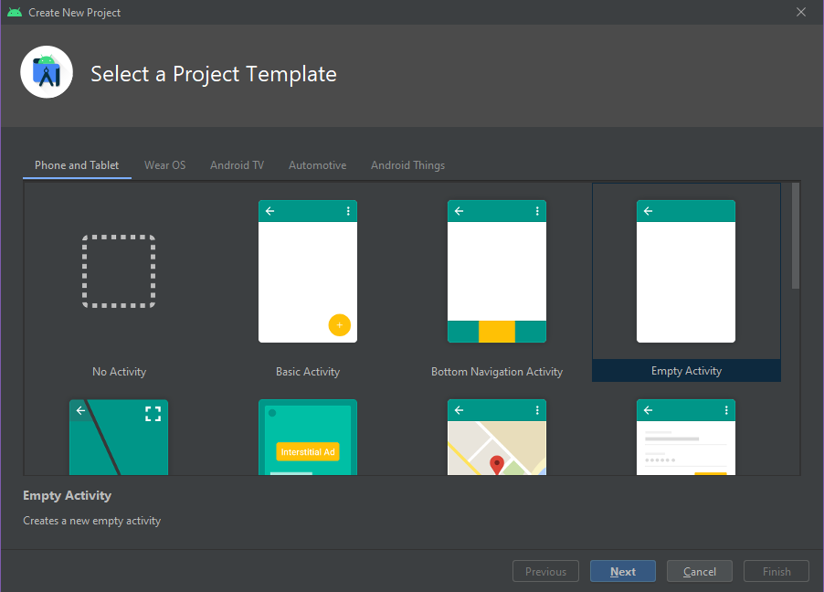
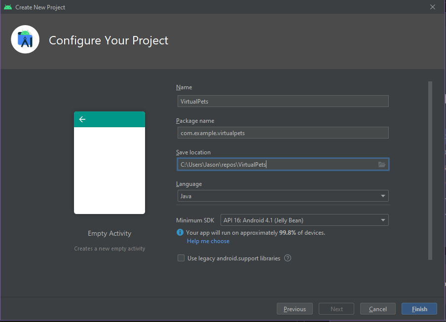
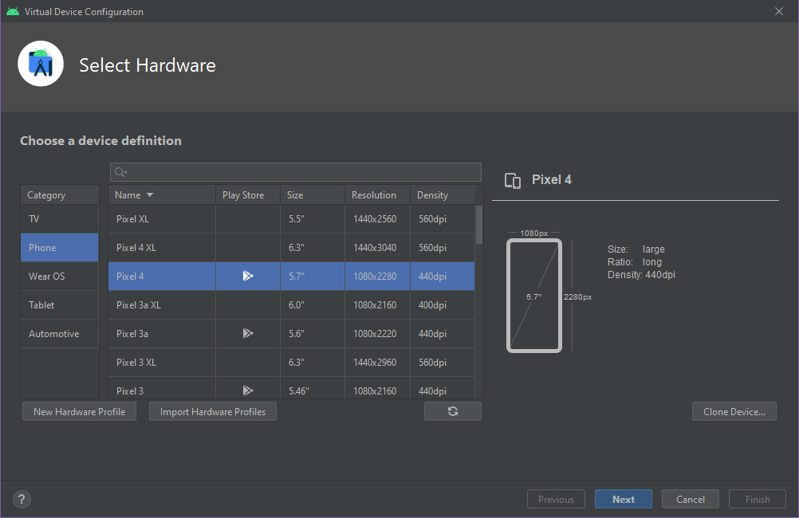
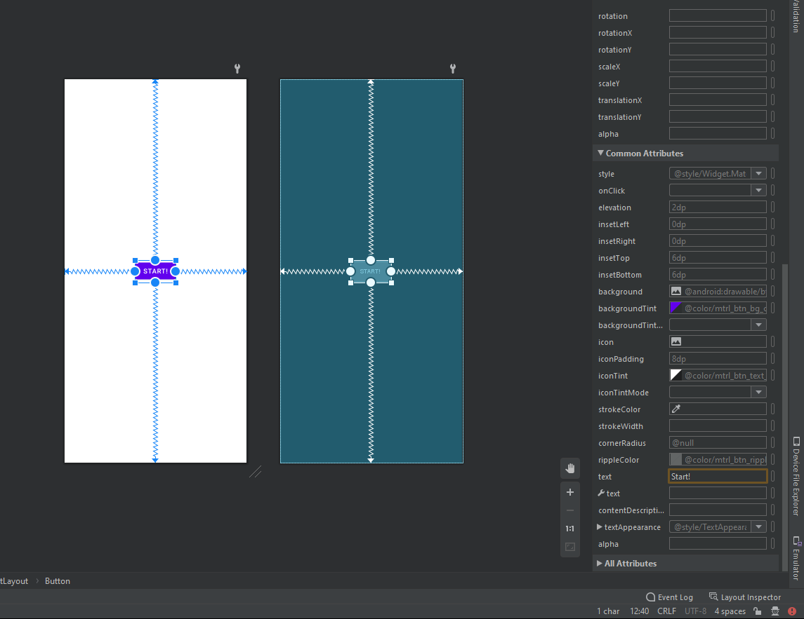
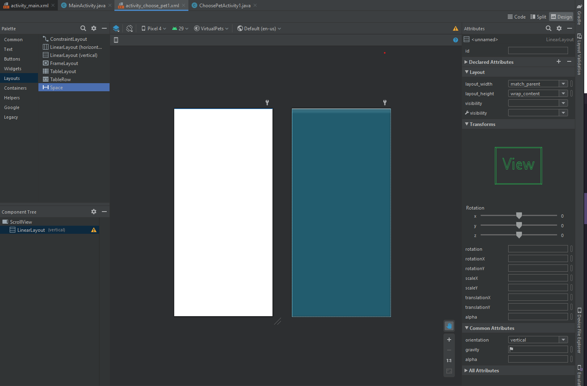
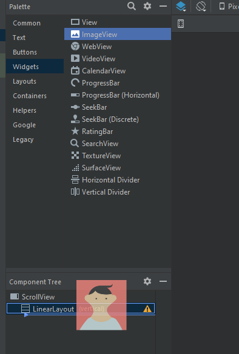
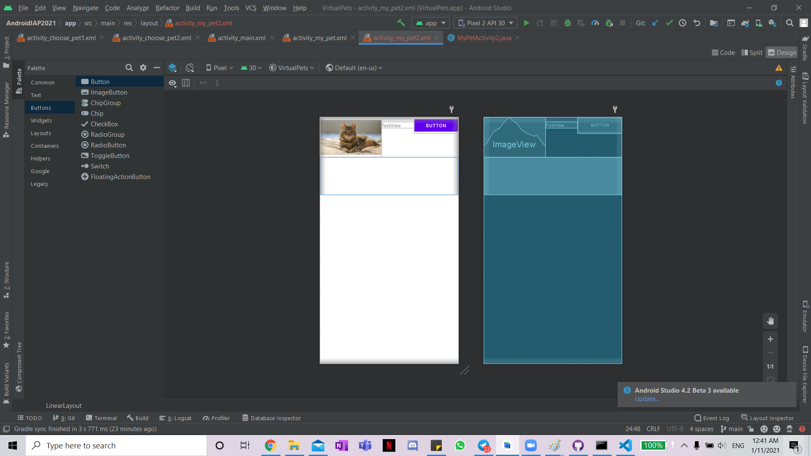

# Day 1:

Welcome to Android Studio! This will be the starting page: click on "Create New Project"


Depending on what kind of app/page template you want to start with, you can click on the options, but for the workshop (and in most cases) we will be using "Empty Activity"



Rename the file, and under options choose "Java" 



Wait for a while, the bottom should show some processes running on startup. When done, screen looks like this (... started). Dismiss the "What's New" panel.


Navigation around Android Studio: files on the left, editing in the middle, running on the top right 


Setting up Virtual Device (Simulator). Go to the box beside app and click on AVD Manager to download a simulator of your choice. 




Download one of the latest releases and click next. It'll take a while to download (about 1.1GB) so just be patient. 


Run bar


After launching, your simulator should show this (default 'hello world' code)


======

Now, we move onto the GUI, the place where you are going to arrange the layout of your app. This workshop will touch on the UI Designer method, but you can choose to code it out in the XML file directly too. 


Layouts are how we will be arranging our elements. Here, we use constraintlayout which will automatically organize for us the spacing depending on the constraints we set (already done by default). 
Try changing the textView "Hello World" to a start button, and see how it changes in the XML code. 


Alternative code method, from

```xml
<TextView
    android:layout_width="wrap_content"
    android:layout_height="wrap_content"
    android:text="Hello World!"
    app:layout_constraintBottom_toBottomOf="parent"
    app:layout_constraintLeft_toLeftOf="parent"
    app:layout_constraintRight_toRightOf="parent"
    app:layout_constraintTop_toTopOf="parent" />
```

to 

```xml
<Button
    android:layout_width="wrap_content"
    android:layout_height="wrap_content"
    android:text="Start!"
    app:layout_constraintBottom_toBottomOf="parent"
    app:layout_constraintLeft_toLeftOf="parent"
    app:layout_constraintRight_toRightOf="parent"
    app:layout_constraintTop_toTopOf="parent" />
```

All elements need an id: Assign id to the start button


Code looks like that

```xml
<?xml version="1.0" encoding="utf-8"?>
<androidx.constraintlayout.widget.ConstraintLayout xmlns:android="http://schemas.android.com/apk/res/android"
    xmlns:app="http://schemas.android.com/apk/res-auto"
    xmlns:tools="http://schemas.android.com/tools"
    android:layout_width="match_parent"
    android:layout_height="match_parent"
    tools:context=".MainActivity">

    <Button
        android:id="@+id/startButton"
        android:layout_width="wrap_content"
        android:layout_height="wrap_content"
        android:text="Start!"
        app:layout_constraintBottom_toBottomOf="parent"
        app:layout_constraintLeft_toLeftOf="parent"
        app:layout_constraintRight_toRightOf="parent"
        app:layout_constraintTop_toTopOf="parent" />

</androidx.constraintlayout.widget.ConstraintLayout>
```

Result (Can try running it in the simulator to test it out)



Create new activity (or new page) called `ChoosePetActivity1`for you to choose your first pet. 


ScrollView will allow the user to scroll the page if it takes up more space than allowed on the phone. Add ScrollView to the page 


Add Linear Layout inside ScrollView



Download some images to be your pets and import them to your Android Studio/.../drawables folder. 

Open resource manager and import drawables.


Import all images with import more files.


You'll now be able to see images in the resource manager.

Go to widgets and add the images to your page by dragging ImageView into linearlayout.



Choose the image that you want.


Some images may be too tall, so you need to set `scaleType` to `centerInside` and `adjustViewBounds` to `true`.


We will need to get reference to each image in the Java file later. Name your pictures simply and distinguishably. 


Add a title to the page, in terms of a textView element. 


Create another activity called `ChoosePetActivity2` to pick your second pet. You can just copy the code from the first xml to the next, change `tools:context` to `.ChoosePetActivity2`, change title text to `Choose Pet #2`.


Create activity called `MyPetActivity` to display the 2 pets.

Convert root layout to `LinearLayout` by doing convert view, and change from horizontal to vertical 


Add two linear layouts


Add an ImageView, textView and button for the first linear layout, and do the same for the second. 




Rename all the ids to be distinguishable so that they will be easy to call in the Java file. 


## Java Part

In `MainActivity.java` inside `onCreate` function add reference to button (tell them to use alt-enter to import)

```java
Button button = findViewById(R.id.startButton);
```

Then add a click listener.

```java
button.setOnClickListener(new View.OnClickListener() {
    @Override
    public void onClick(View view) {
        
    }
});
```

Talk about intents, going to new activity

```java
Intent intent = new Intent(getApplicationContext(), ChoosePetActivity1.class);
startActivity(intent);
```

<details>
  <summary>Final Code of MainActivity.java</summary>

```java
package com.example.virtualpets;

import androidx.appcompat.app.AppCompatActivity;

import android.content.Intent;
import android.os.Bundle;
import android.view.View;
import android.widget.Button;

public class MainActivity extends AppCompatActivity {

    @Override
    protected void onCreate(Bundle savedInstanceState) {
        super.onCreate(savedInstanceState);
        setContentView(R.layout.activity_main);

        Button button = findViewById(R.id.startButton);

        button.setOnClickListener(new View.OnClickListener() {
            @Override
            public void onClick(View view) {
                Intent intent = new Intent(MainActivity.this, ChoosePetActivity1.class);
                startActivity(intent);
            }
        });
    }
}
```

</details>

For `ChoosePetActivity1`,

Set references to images

```java
ImageView catImage = findViewById(R.id.catImage);
ImageView dogImage = findViewById(R.id.dogImage);
ImageView fishImage = findViewById(R.id.fishImage);
```

Get reference to SharedPreferences (explain what this is), so that we can save the information about Pet Chosen

```java
SharedPreferences sharedPref = getSharedPreferences(getString(R.string.preference_file_key), Context.MODE_PRIVATE);
```

Create a convenience function to go next activity, below onCreate. (Can consider simplifying this, just copy this code instead of writing function)

```java
private void goNextActivity() {
    Intent intent = new Intent(this, ChoosePetActivity2.class);
    startActivity(intent);
}
```

Inside oncreate, Set onclicklisteners (explain what this is), write to sharedpreference to save the pet choice, then go next activity.

```java
catImage.setOnClickListener(view -> {
    sharedPref.edit().putString("pet1", "cat").apply();
    goNextActivity();
});

dogImage.setOnClickListener(view -> {
    sharedPref.edit().putString("pet1", "dog").apply();
    goNextActivity();
});

fishImage.setOnClickListener(view -> {
    sharedPref.edit().putString("pet1", "fish").apply();
    goNextActivity();
});
```

<details>
  <summary>Final code for ChoosePetsActivity1.java looks like this</summary>

```java
package com.example.virtualpets;

import androidx.appcompat.app.AppCompatActivity;

import android.content.Context;
import android.content.Intent;
import android.content.SharedPreferences;
import android.os.Bundle;
import android.view.View;
import android.widget.ImageView;

public class ChoosePetActivity1 extends AppCompatActivity {

    @Override
    protected void onCreate(Bundle savedInstanceState) {
        super.onCreate(savedInstanceState);
        setContentView(R.layout.activity_choose_pet1);

        // Set references to Images
        ImageView catImage = findViewById(R.id.catImage);
        ImageView dogImage = findViewById(R.id.dogImage);
        ImageView fishImage = findViewById(R.id.fishImage);

        // Get a reference to SharedPreferences
        SharedPreferences sharedPref = getSharedPreferences(getString(R.string.preference_file_key), Context.MODE_PRIVATE);

        catImage.setOnClickListener(view -> {
            sharedPref.edit().putString("pet1", "cat").apply();
            goNextActivity();
        });

        dogImage.setOnClickListener(view -> {
            sharedPref.edit().putString("pet1", "dog").apply();
            goNextActivity();
        });

        fishImage.setOnClickListener(view -> {
            sharedPref.edit().putString("pet1", "fish").apply();
            goNextActivity();
        });


    }

    private void goNextActivity() {
        Intent intent = new Intent(this, ChoosePetActivity2.class);
        startActivity(intent);
    }
}
```

</details>


Do the same for the ChoosePetActivity2, but change `pet1` to `pet2`, and modify goNexTActivity.

<details>
  <summary>Final code for ChoosePetActivity2</summary>
  
```java
package com.example.virtualpets;

import androidx.appcompat.app.AppCompatActivity;

import android.content.Context;
import android.content.Intent;
import android.content.SharedPreferences;
import android.os.Bundle;
import android.widget.ImageView;

public class ChoosePetActivity2 extends AppCompatActivity {

    @Override
    protected void onCreate(Bundle savedInstanceState) {
        super.onCreate(savedInstanceState);
        setContentView(R.layout.activity_choose_pet2);

        // Set references to Images
        ImageView catImage = findViewById(R.id.catImage);
        ImageView dogImage = findViewById(R.id.dogImage);
        ImageView fishImage = findViewById(R.id.fishImage);

        // Get a reference to SharedPreferences
        SharedPreferences sharedPref = getSharedPreferences(getString(R.string.preference_file_key), Context.MODE_PRIVATE);

        catImage.setOnClickListener(view -> {
            sharedPref.edit().putString("pet2", "cat").apply();
            goNextActivity();
        });

        dogImage.setOnClickListener(view -> {
            sharedPref.edit().putString("pet2", "dog").apply();
            goNextActivity();
        });

        fishImage.setOnClickListener(view -> {
            sharedPref.edit().putString("pet2", "fish").apply();
            goNextActivity();
        });


    }

    private void goNextActivity() {
        Intent intent = new Intent(this, MyPetActivity.class);
        startActivity(intent);
    }
}
```

</details>

For `MyPetActivity`,

Same stuff, get reference to views first.

```java
ImageView pet1Image = findViewById(R.id.pet1Image);
TextView pet1HungerText = findViewById(R.id.pet1HungerText);
Button pet1Button = findViewById(R.id.pet1Button);

ImageView pet2Image = findViewById(R.id.pet2Image);
TextView pet2HungerText = findViewById(R.id.pet2HungerText);
Button pet2Button = findViewById(R.id.pet2Button);
```

Then get the sharedpreferences, we will need to read the pets from it. Explain how the getstring works

```java
// Get copy of sharedpreferences
SharedPreferences sharedPref = getSharedPreferences(getString(R.string.preference_file_key), Context.MODE_PRIVATE);

// Get Pet1, default to cat
String pet1 = sharedPref.getString("pet1", "cat");

// Get Pet2, default to dog
String pet2 = sharedPref.getString("pet2", "dog");
```

Write a convenience function to initialise the widgets for each pet.

```java
private void initialiseWidgetsForPet(ImageView petImage, TextView hungerText,
                                      Button petButton, String pet) {
    // This function runs for each pet we have

    // Set the image based on which pet it is
    if (pet.equals("cat")) {
        petImage.setImageResource(R.drawable.cat);
    } else if (pet.equals("dog")) {
        petImage.setImageResource(R.drawable.dog);
    } else {    // Else it probably is a fish
        petImage.setImageResource(R.drawable.fish);
    }

    // Set the hungerText to 100 at first
    hungerText.setText(Integer.toString(100));

    // Set onclicklistener to increment hunger by 1 for each button click
    petButton.setOnClickListener(view -> {
        int oldHunger = Integer.parseInt(hungerText.getText().toString());
        hungerText.setText(Integer.toString(oldHunger + 1));
    });
}
```

Add the call to the convenience function at oncreate.

```java
initialiseWidgetsForPet(pet1Image, pet1HungerText, pet1Button, pet1);
initialiseWidgetsForPet(pet2Image, pet2HungerText, pet2Button, pet2);
```

<details>
  <summary>Final code for MyPetActivity.java</summary>

```java
package com.example.virtualpets;

import androidx.appcompat.app.AppCompatActivity;

import android.content.Context;
import android.content.SharedPreferences;
import android.os.Bundle;
import android.widget.Button;
import android.widget.ImageView;
import android.widget.TextView;

public class MyPetActivity extends AppCompatActivity {

    @Override
    protected void onCreate(Bundle savedInstanceState) {
        super.onCreate(savedInstanceState);
        setContentView(R.layout.activity_my_pet);

        // Set references to widgets in layout file
        ImageView pet1Image = findViewById(R.id.pet1Image);
        TextView pet1HungerText = findViewById(R.id.pet1HungerText);
        Button pet1Button = findViewById(R.id.pet1Button);

        ImageView pet2Image = findViewById(R.id.pet2Image);
        TextView pet2HungerText = findViewById(R.id.pet2HungerText);
        Button pet2Button = findViewById(R.id.pet2Button);

        // Get copy of sharedpreferences
        SharedPreferences sharedPref = getSharedPreferences(getString(R.string.preference_file_key), Context.MODE_PRIVATE);

        // Get Pet1, default to cat
        String pet1 = sharedPref.getString("pet1", "cat");

        // Get Pet2, default to dog
        String pet2 = sharedPref.getString("pet2", "dog");

        initialiseWidgetsForPet(pet1Image, pet1HungerText, pet1Button, pet1);
        initialiseWidgetsForPet(pet2Image, pet2HungerText, pet2Button, pet2);
    }

    private void initialiseWidgetsForPet(ImageView petImage, TextView hungerText,
                                         Button petButton, String pet) {
        // This function runs for each pet we have

        // Set the image based on which pet it is
        if (pet.equals("cat")) {
            petImage.setImageResource(R.drawable.cat);
        } else if (pet.equals("dog")) {
            petImage.setImageResource(R.drawable.dog);
        } else {    // Else it probably is a fish
            petImage.setImageResource(R.drawable.fish);
        }

        // Set the hungerText to 100 at first
        hungerText.setText(Integer.toString(100));

        // Set onclicklistener to increment hunger by 1 for each button click
        petButton.setOnClickListener(view -> {
            int oldHunger = Integer.parseInt(hungerText.getText().toString());
            hungerText.setText(Integer.toString(oldHunger + 1));
        });
    }
}
```

</details>