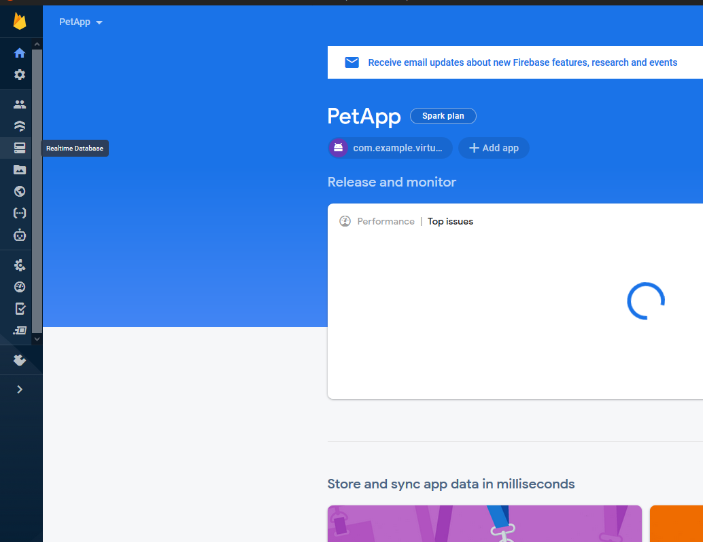
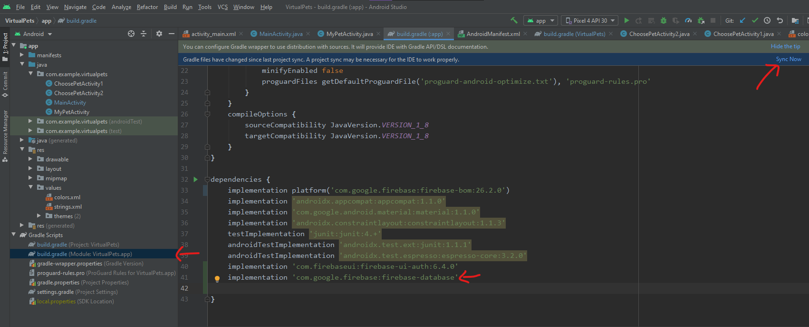
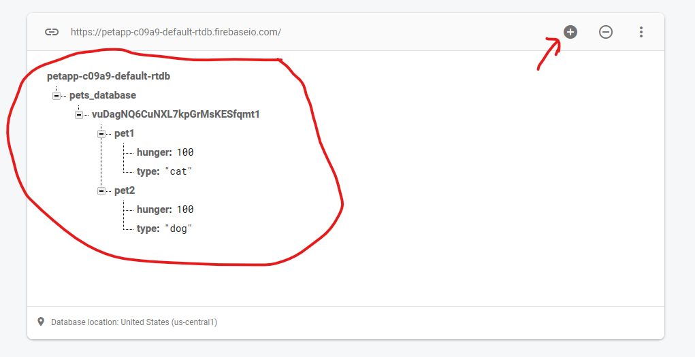

# Day 2: Firebase Database

Right now, everytime we restart the app, we need to rechoose our pets and the hunger level of our pets get reset. We could try to save the pet's data on our phone and retrieve that data everytime we login, but what if we signed in from a different device? Our pet data woudl be lost!

One good solution to this is to **store our pets' data online in a database**! We can retrieve our pet's data anywhere from this database. Luckily for us, Firebase supports databases!

Firebase Database stores data in a **JSON-like structure**. Meaning something like that

```json
{
  "pets_database": {
    "someuserid1": {
      "pet1": {
        "type": "dog",
        "hunger": 100
      },
      "pet2": {
        "type": "cat",
        "hunger": 80
      }
    },
    "someuserid2": {
      "pet1": {
        "type": "cat",
        "hunger": 88
      },
      "pet2": {
        "type": "fish",
        "hunger": 66
      }
    }
  }
}
```

Note that this is a tree-like data structure with **parent and child elements**. We shall be using this JSON structure to store our pet data!

## Creating a Firebase Database

1. Head back to the Firebase Console website. Select Realtime Database from the left panel.

    

2. Click on **Create Database** and just select **United States** for the location.
3. Select **Start in Test Mode** to allow all read/writes to our database, for our convenience for now. The page should now look like this:

    

4. You can actually interact with the database like this graphically. But we will not do it for now


## Adding Firebase Realtime Database to our Android app

We will need to add the dependency for Realtime Database. Go to the **module-level** `build.gradle` file and add the following line under dependencies:

```groovy
implementation 'com.google.firebase:firebase-database'
```

Then press **Sync now**,




## Writing to Firebase Database

Let us save our data to Firebase Database when we choose pets. Head over to `MyPetActivity.java`.

1. First, we need to get a reference to our Firebase Database. Copy the following code into `MyPetActivity.java`, before the onCreate function. (Remember to import using alt-enter)

    ```java
    DatabaseReference mDatabase;
    DatabaseReference mUserRef;
    ```

2. Before the `onCreate` function, below the part where we retrieved our pet names from `SharedPreferences`, copy the following code

    ```java
    mDatabase = FirebaseDatabase.getInstance().getReference();
    ```

3. We now need to create references to where we want to put our pet data. We want to put our data under our userId. So **get the userId from Firebase Auth** using the following code

    ```java
    String userId = FirebaseAuth.getInstance().getCurrentUser().getUid();
    ```

4. Now to get a reference where we want to put our own user's pet data, use the following code

    ```java
    mUserRef = mDatabase.child("pets_database").child(userId);
    ```

5. Now that we have a reference of where to write our data, we just need to write the data in the respective fields. We have 4 data to write (The type of pet1, the hunger value of pet1, the type of pet2 and the hunger value of pet2). We shall do this using the following code

    ```java
    mUserRef.child("pet1").child("type").setValue(pet1);
    mUserRef.child("pet1").child("hunger").setValue(100);
    mUserRef.child("pet2").child("type").setValue(pet2);
    mUserRef.child("pet2").child("hunger").setValue(100);
    ```

6. We will also need to do some modifications to allow the feed button to automatically write the new hunger value to database as well. First, we need to modify the `initialiseWidgetsForPet` function to take in the petId (i.e. "pet1" or "pet2"), so that we know which pet value we are changing.

    ```java
    private void initialiseWidgetsForPet(String petId, ImageView petImage, TextView hungerText,
                                         Button petButton, String pet, int petHungerValue) { 
                                           ...
    ```

7. Right after the part where we set the Textview to the new value in the `initaliseWidgetsForPet` function, we need to write to the database the new pet hunger value

    ```java
    mUserRef.child(petId).child("hunger").setValue(oldHunger + 1);
    ```

8. Try out the app, try selecting your 2 pets.
9. Now check back with your Firebase Realtime Database on the website. You should now see there is new data. Click on the big "+" sign to expand all data, and you should see your data like this:

    

10. If you check the long string under the `pets_database`, you will realise it corresponds to your UserID in Firebase Auth (you can see it on the website)!
11. If you feed your pets, you should also see the pet's hunger value increasing in the Firebase Database.

<details>
  <summary>Final Code for MyPetActivity.java</summary>

```java
package com.example.virtualpets;

import androidx.appcompat.app.AppCompatActivity;

import android.content.Context;
import android.content.SharedPreferences;
import android.os.Bundle;
import android.widget.Button;
import android.widget.ImageView;
import android.widget.TextView;

import com.google.firebase.auth.FirebaseAuth;
import com.google.firebase.database.DatabaseReference;
import com.google.firebase.database.FirebaseDatabase;

public class MyPetActivity extends AppCompatActivity {
    DatabaseReference mDatabase;
    DatabaseReference mUserRef;

    @Override
    protected void onCreate(Bundle savedInstanceState) {
        super.onCreate(savedInstanceState);
        setContentView(R.layout.activity_my_pet);

        // Set references to widgets in layout file
        ImageView pet1Image = findViewById(R.id.pet1Image);
        TextView pet1HungerText = findViewById(R.id.pet1HungerText);
        Button pet1Button = findViewById(R.id.pet1Button);

        ImageView pet2Image = findViewById(R.id.pet2Image);
        TextView pet2HungerText = findViewById(R.id.pet2HungerText);
        Button pet2Button = findViewById(R.id.pet2Button);

        // Get copy of sharedpreferences
        SharedPreferences sharedPref = getSharedPreferences(getString(R.string.preference_file_key), Context.MODE_PRIVATE);

        // Get Pet1, default to cat
        String pet1 = sharedPref.getString("pet1", "cat");

        // Get Pet2, default to dog
        String pet2 = sharedPref.getString("pet2", "dog");

        // Get a reference to our Firebase Realtime Database
        mDatabase = FirebaseDatabase.getInstance().getReference();

        // Get our user's Id
        String userId = FirebaseAuth.getInstance().getCurrentUser().getUid();

        // Get reference to our user's pet data
        mUserRef = mDatabase.child("pets_database").child(userId);

        mUserRef.child("pet1").child("type").setValue(pet1);
        mUserRef.child("pet1").child("hunger").setValue(100);
        mUserRef.child("pet2").child("type").setValue(pet2);
        mUserRef.child("pet2").child("hunger").setValue(100);

        initialiseWidgetsForPet("pet1", pet1Image, pet1HungerText, pet1Button, pet1);
        initialiseWidgetsForPet("pet2", pet2Image, pet2HungerText, pet2Button, pet2);
    }

    private void initialiseWidgetsForPet(String petId, ImageView petImage, TextView hungerText,
                                         Button petButton, String pet) {
        // This function runs for each pet we have

        // Set the image based on which pet it is
        if (pet.equals("cat")) {
            petImage.setImageResource(R.drawable.cat);
        } else if (pet.equals("dog")) {
            petImage.setImageResource(R.drawable.dog);
        } else {    // Else it probably is a fish
            petImage.setImageResource(R.drawable.fish);
        }

        // Set the hungerText to 100 at first
        hungerText.setText(Integer.toString(100));

        // Set onclicklistener to increment hunger by 1 for each button click
        petButton.setOnClickListener(view -> {
            int oldHunger = Integer.parseInt(hungerText.getText().toString());
            hungerText.setText(Integer.toString(oldHunger + 1));
            mUserRef.child(petId).child("hunger").setValue(oldHunger + 1);
        });
    }
}
```
</details>

## Reading from Firebase Realtime Database Once

Now that we are able to store data on the Database, we also need a way to read the data. This will allow us to access our stored pet data anytime from any device!
More specifically, if we already have pet data stored on Database, we do not want to go through the choosing pet sequence all over again, and we want to immediately see our current pets and their hunger values.

In technical terms, after User Sign-in in `MainActivity`, we want to:

  1. Check if the user already has pre-existing pet data in database
  2. If yes, bring them to `MyPetActivity` directly
  3. Replace the ImageViews' image with their pets
  4. Replace the TextViews with their pets' actual hunger values
  5. We also want to constantly listen to hunger value changes and update them (e.g. we feed our pet from another device)

Let's start!

1. Let's start off by going to `MainActivity`'s `onActivityResult` function, when the user successfully signs in
2. We will need the user's id, get that by pasting the below code, into the part right after the `Toast.makeText` where we welcome the user.

    ```java
    Toast.makeText(this, "Welcome " + userName, Toast.LENGTH_SHORT).show();
    ```

3. Then, we will to set up reference to our database and where we expect our user's data to be.
  
    ```java
    DatabaseReference mDatabase = FirebaseDatabase.getInstance().getReference();
    DatabaseReference mUser = mDatabase.child("pets_database").child(userId);
    ```

4. Now we will need to attempt to read data from where we expect the user's data to be. We use `addListenerForSingleValueEvent()`, which lets us send a single request for the user's data. The result will be returned as a `DataSnapshot` in the `onDataChange` function

    ```java
    mUser.addListenerForSingleValueEvent(new ValueEventListener() {
        @Override
        public void onDataChange(@NonNull DataSnapshot snapshot) {

        }

        @Override
        public void onCancelled(@NonNull DatabaseError error) {

        }
    });
    ```

5.  We need to fill in the `onDataChange` function. To check whether the data actually exists, we can use `if (snapshot.exists())`. Shift the part where we navigate to the `ChoosePetActivity1` to the `else` statement (i.e. user pet data does not exist)

    ```java
    public void onDataChange(@NonNull DataSnapshot snapshot) {
      if (snapshot.exists()) {

      } else {
          // Go to ChoosePetActivity
          Intent intent = new Intent(MainActivity.this, ChoosePetActivity1.class);
          startActivity(intent);
      }
    }
    ```

6.  If the snapshot exists, we will extract out the data and put it into SharedPreferences. Note that previously we did not put hunger values in SharedPreferences. We will have to create a new key for it. Recall that we can get SharedPreferences with 

    ```java
    SharedPreferences sharedPref = getSharedPreferences(getString(R.string.preference_file_key), Context.MODE_PRIVATE);
    ```

7.  Recall we can edit SharedPreferences with `sharedPref.edit()`
8.  To extract pet 1's type, we use `snapshot.child("pet1").child("type").getValue(String.class);`. Note that `String.class` is used to tell Firebase we know we are extracting a string
9.  To extract pet 1's hunger value, we use `snapshot.child("pet1").child("hunger").getValue(int.class);`. Note that `int.class` is used since hunger value is an int.
10. We repeat the same for pet 2, and commit these changes into SharedPreferences, using `apply()`.
11. To sum up Steps 7-10, the code looks like this

    ```java
    sharedPref.edit()
        .putString("pet1", snapshot.child("pet1").child("type").getValue(String.class))
        .putInt("pet1hunger", snapshot.child("pet1").child("hunger").getValue(int.class))
        .putString("pet2", snapshot.child("pet2").child("type").getValue(String.class))
        .putInt("pet2hunger", snapshot.child("pet2").child("hunger").getValue(int.class))
        .apply();
    ```

12. Don't forget that we need to navigate the user to `MyPetActivity` instead now.

    ```java
    Intent intent = new Intent(MainActivity.this, MyPetActivity.class);
    startActivity(intent);
    ```

13. We need to modify the code in `MyPetActivity.java` a little as well, to accept our new `pet1hunger` and `pet2hunger` we are passing into SharedPreferences. At the part where we get the pet types from SharedPreferences, we will get these 2 values, and set them to a default of `100` if they did not exist before (i.e. pet data did not previously exist).

    ```java
    int pet1HungerValue = sharedPref.getInt("pet1hunger", 100);
    int pet2HungerValue = sharedPref.getInt("pet2hunger", 100);
    ```

14. We need to modify the `initialiseWidgetsForPet` function to accept our new initial hunger values as a parameter.

    ```java
    private void initialiseWidgetsForPet(String petId, ImageView petImage, TextView hungerText,
                                         Button petButton, String pet, int petHungerValue) {
                                           ...
    ```

15. Then within `initaliseWidgetsForPet`, we need to modify the `hungerText.setText()` to set the initial hunger value to the `petHungerValue`.

    ```java
    hungerText.setText(Integer.toString(petHungerValue));
    ```

16. Phew, we're done! If you test your app now, you should realise that if you have signed in before, you should automatically get brought to the `MyPetActivity` with your previous data.

<details>
  <summary>Final code for MainActivity.java</summary>

```java
package com.example.virtualpets;

import androidx.annotation.NonNull;
import androidx.annotation.Nullable;
import androidx.appcompat.app.AppCompatActivity;

import android.content.Context;
import android.content.Intent;
import android.content.SharedPreferences;
import android.os.Bundle;
import android.view.View;
import android.widget.Button;
import android.widget.Toast;


import com.firebase.ui.auth.AuthUI;
import com.google.firebase.auth.FirebaseAuth;
import com.google.firebase.auth.FirebaseUser;
import com.google.firebase.database.DataSnapshot;
import com.google.firebase.database.DatabaseError;
import com.google.firebase.database.DatabaseReference;
import com.google.firebase.database.FirebaseDatabase;
import com.google.firebase.database.ValueEventListener;

import java.util.Arrays;
import java.util.List;

public class MainActivity extends AppCompatActivity {

    List<AuthUI.IdpConfig> providers = Arrays.asList(
            new AuthUI.IdpConfig.GoogleBuilder().build());
    private static final int RC_SIGN_IN = 0;

    @Override
    protected void onCreate(Bundle savedInstanceState) {
        super.onCreate(savedInstanceState);
        setContentView(R.layout.activity_main);

        Button button = findViewById(R.id.startButton);

        button.setOnClickListener(view -> {
            startActivityForResult(
                    AuthUI.getInstance()
                            .createSignInIntentBuilder()
                            .setAvailableProviders(providers)
                            .build(),
                    RC_SIGN_IN);


        });
    }

    @Override
    protected void onActivityResult(int requestCode, int resultCode, @Nullable Intent data) {
        super.onActivityResult(requestCode, resultCode, data);

        if (requestCode == RC_SIGN_IN) {
            // Asserts that this result came from our FirebaseUI

            if (resultCode == RESULT_OK) {
                // Means the user successfully signed in
                // We can now get the details of the Firebase User
                FirebaseUser user = FirebaseAuth.getInstance().getCurrentUser();

                // Get the name of the user
                String userName = user.getDisplayName();

                // Show a message welcoming the user
                Toast.makeText(this, "Welcome " + userName, Toast.LENGTH_SHORT).show();

                // Get Signed-in user's id
                String userId = user.getUid();
                // Get Reference to database
                DatabaseReference mDatabase = FirebaseDatabase.getInstance().getReference();
                // Get Reference to where we expect user's data to be
                DatabaseReference mUser = mDatabase.child("pets_database").child(userId);
                // Use this function to attempt to read data from our reference
                mUser.addListenerForSingleValueEvent(new ValueEventListener() {
                    @Override
                    public void onDataChange(@NonNull DataSnapshot snapshot) {
                        // Check whether user has does indeed have existing pet data
                        if (snapshot.exists()) {
                            // If data exists, we want to extract the pet types and hunger values
                            // And store them into sharedPreferences

                            SharedPreferences sharedPref = getSharedPreferences(getString(R.string.preference_file_key), Context.MODE_PRIVATE);
                            sharedPref.edit()
                                    .putString("pet1", snapshot.child("pet1").child("type").getValue(String.class))
                                    .putInt("pet1hunger", snapshot.child("pet1").child("hunger").getValue(int.class))
                                    .putString("pet2", snapshot.child("pet2").child("type").getValue(String.class))
                                    .putInt("pet2hunger", snapshot.child("pet2").child("hunger").getValue(int.class))
                                    .apply();

                            // Go to MyPetActivity
                            Intent intent = new Intent(MainActivity.this, MyPetActivity.class);
                            startActivity(intent);
                        } else {
                            // Go to ChoosePetActivity
                            Intent intent = new Intent(MainActivity.this, ChoosePetActivity1.class);
                            startActivity(intent);
                        }
                    }

                    @Override
                    public void onCancelled(@NonNull DatabaseError error) {

                    }
                });

            } else {
                Toast.makeText(this, "Sign in Failed!", Toast.LENGTH_SHORT).show();
            }
        }
    }
}
```

</details>

<details>
  <summary>Final code for MyPetActivity.java</summary>

```java
package com.example.virtualpets;

import androidx.annotation.NonNull;
import androidx.appcompat.app.AppCompatActivity;

import android.content.Context;
import android.content.SharedPreferences;
import android.os.Bundle;
import android.widget.Button;
import android.widget.ImageView;
import android.widget.TextView;

import com.google.firebase.auth.FirebaseAuth;
import com.google.firebase.database.DataSnapshot;
import com.google.firebase.database.DatabaseError;
import com.google.firebase.database.DatabaseReference;
import com.google.firebase.database.FirebaseDatabase;
import com.google.firebase.database.ValueEventListener;

public class MyPetActivity extends AppCompatActivity {
    DatabaseReference mDatabase;
    DatabaseReference mUserRef;

    @Override
    protected void onCreate(Bundle savedInstanceState) {
        super.onCreate(savedInstanceState);
        setContentView(R.layout.activity_my_pet);

        // Set references to widgets in layout file
        ImageView pet1Image = findViewById(R.id.pet1Image);
        TextView pet1HungerText = findViewById(R.id.pet1HungerText);
        Button pet1Button = findViewById(R.id.pet1Button);

        ImageView pet2Image = findViewById(R.id.pet2Image);
        TextView pet2HungerText = findViewById(R.id.pet2HungerText);
        Button pet2Button = findViewById(R.id.pet2Button);

        // Get copy of sharedpreferences
        SharedPreferences sharedPref = getSharedPreferences(getString(R.string.preference_file_key), Context.MODE_PRIVATE);

        // Get Pet1, default to cat
        String pet1 = sharedPref.getString("pet1", "cat");
        int pet1HungerValue = sharedPref.getInt("pet1hunger", 100);

        // Get Pet2, default to dog
        String pet2 = sharedPref.getString("pet2", "dog");
        int pet2HungerValue = sharedPref.getInt("pet2hunger", 100);

        // Get a reference to our Firebase Realtime Database
        mDatabase = FirebaseDatabase.getInstance().getReference();

        // Get our user's Id
        String userId = FirebaseAuth.getInstance().getCurrentUser().getUid();

        // Get reference to our user's pet data
        mUserRef = mDatabase.child("pets_database").child(userId);

        mUserRef.child("pet1").child("type").setValue(pet1);
        mUserRef.child("pet1").child("hunger").setValue(pet1HungerValue);
        mUserRef.child("pet2").child("type").setValue(pet2);
        mUserRef.child("pet2").child("hunger").setValue(pet2HungerValue);

        initialiseWidgetsForPet("pet1", pet1Image, pet1HungerText, pet1Button, pet1, pet1HungerValue);
        initialiseWidgetsForPet("pet2", pet2Image, pet2HungerText, pet2Button, pet2, pet2HungerValue);
    }

    private void initialiseWidgetsForPet(String petId, ImageView petImage, TextView hungerText,
                                         Button petButton, String pet, int petHungerValue) {
        // This function runs for each pet we have

        // Set the image based on which pet it is
        if (pet.equals("cat")) {
            petImage.setImageResource(R.drawable.cat);
        } else if (pet.equals("dog")) {
            petImage.setImageResource(R.drawable.dog);
        } else {    // Else it probably is a fish
            petImage.setImageResource(R.drawable.fish);
        }

        hungerText.setText(Integer.toString(petHungerValue));

        // Set onclicklistener to increment hunger by 1 for each button click
        petButton.setOnClickListener(view -> {
            int oldHunger = Integer.parseInt(hungerText.getText().toString());
            hungerText.setText(Integer.toString(oldHunger + 1));
            mUserRef.child(petId).child("hunger").setValue(oldHunger + 1);
        });
    }
}
```

</details>

## Continously listening for updates to Firebase Realtime Database

Now, we need our `MyPetActivity` to continuously listen for updates from the Firebase Realtime Database! This is to accomodate for the case where the user is logged in from multiple devices at the same time.

To do that, instead of `addListenerForSingleValueEvent()`, we can use `addValueEventListener()`, which constantly listens for changes in values. The syntax is almost the same as `addListenerForSingleValueEvent()`. Think about where to put this code, how to get the correct reference, and what you need to do when the hunger value changes.

```java
<fillInWithYourRef>.addValueEventListener(new ValueEventListener() {
    @Override
    public void onDataChange(@NonNull DataSnapshot snapshot) {
        // What should you do when the hunger value changes?
    }

    @Override
    public void onCancelled(@NonNull DatabaseError error) {

    }
});
```

