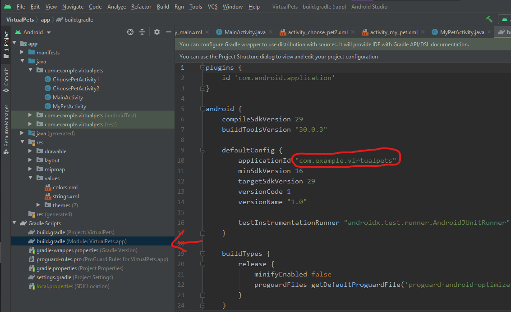
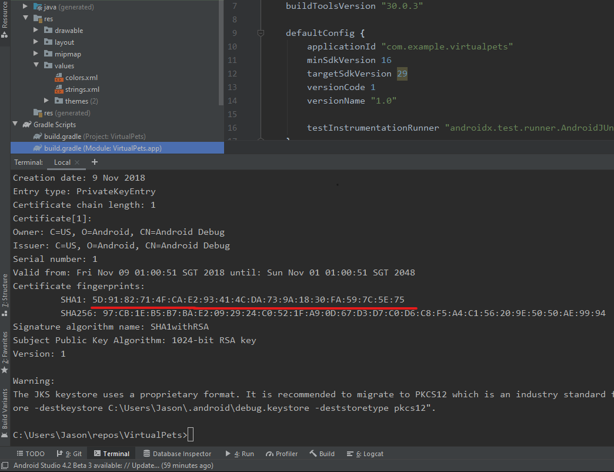
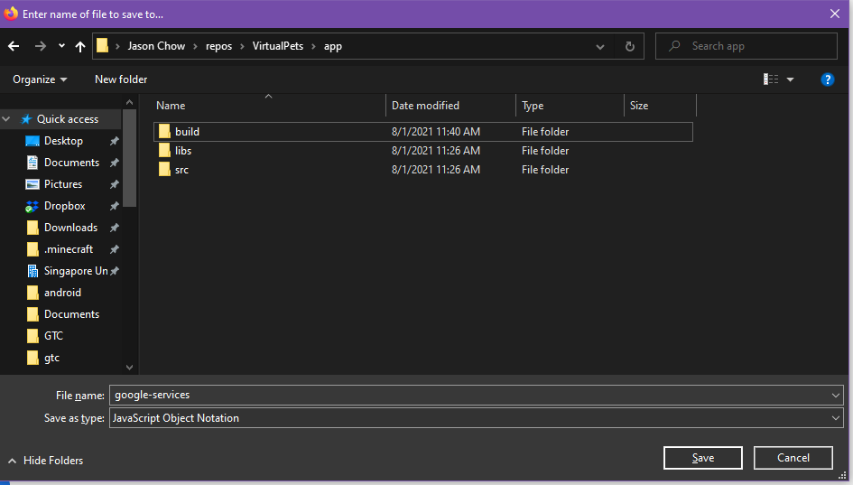
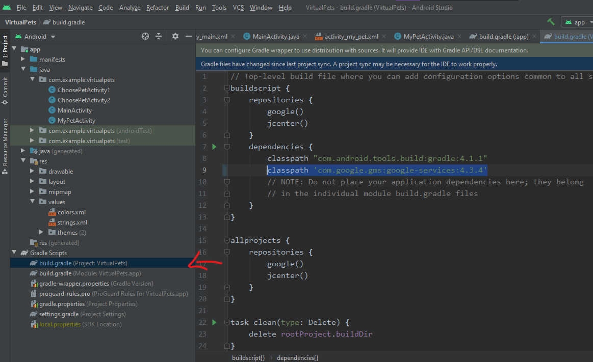
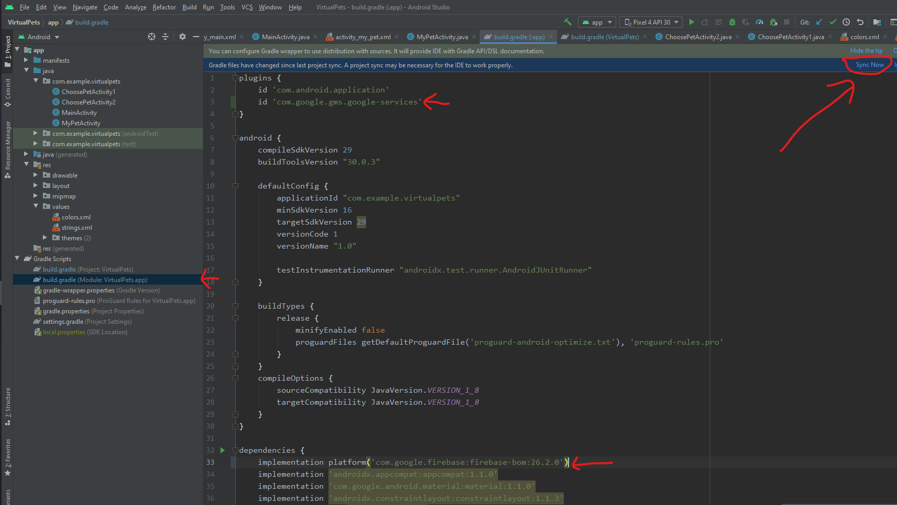

# Day 2: Adding Firebase to your project

Before we are able to use any of Firebase services, you need to connect the Firebase Cloud to your project. Let's begin!

## Step 1: Create a Firebase Account

Go to <https://firebase.google.com>, and sign in with a Google account. After logging in, you should be redirected to <https://console.firebase.google.com/>. 


## Step 2: Create a Firebase Project

- Click on the big **Add Project Button**, and enter a project name for your application (I will use `PetApp`)
- The next screen will ask if you want to enable Google Analytics for your app. This doesn't really matter since we won't be using it, but I would just disable it for now.
- Go ahead and click **Create Project**
- Wait for it to be done and click **Continue**. You have now created your first Firebase Project!


## Step 3: Linking the Firebase Project to your Android App

1. Click on the **Android Icon** to add Firebase to Android
2. The first field will ask you for your Android package name. To find it, go to the `build.gradle(Module:app)` file in your Android Studio project (It is found under `Gradle Scripts`). Look for the `applicationId`

    

3. Fill in a nickname for `App nickname`
4. We need the **debug certificate finger**. Open a terminal (look at your bottom bar), and key in the following command (choose based on your OS):

    ```bash
    # For Windows
    keytool -list -v -alias androiddebugkey -keystore %USERPROFILE%\.android\debug.keystore

    # For Mac/Linux
    keytool -list -v \
    -alias androiddebugkey -keystore ~/.android/debug.keystore
    ```

5. When prompted for the password, type in `android`
6. It will display the debug key under `SHA1`. Copy the numbers after it, and paste it into the signing certificate field on firebase.

    

7. Click **Register**
8. Download the `google-services.json` into your `app` folder. Then click **Next**

    

9. We now need to add Firebase SDK to our app. Go to the **project-level** `build.gradle` and add the following code under `dependencies`:

    ```groovy
    classpath 'com.google.gms:google-services:4.3.4'
    ```

    

10. Now go to the **module-level** `build.gradle`. Add the following code under `plugins`:

    ```groovy
    id 'com.google.gms.google-services'
    ```

11. While still in **module-level** `build.gradle`, add the following code under `dependencies`:

    ```groovy
    implementation platform('com.google.firebase:firebase-bom:26.2.0')
    ```

12. Press **Sync Now** near the top right.

    

13. Gradle will take some time to sync. You can see its progress near the bottom of the screen. Meanwhile you are done with the setup on the Firebase Website, so click **Next** and **Continue to the Console**.

We are now done with adding the core Firebase SDK! Now let us start adding the individual Firebase components!