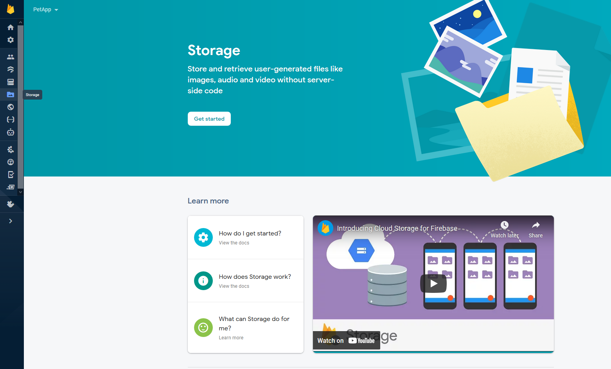
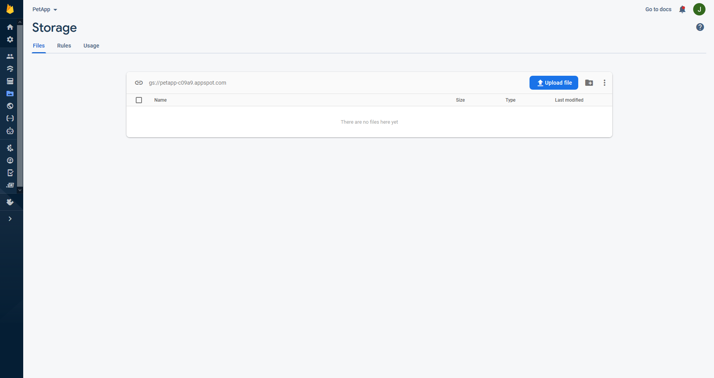
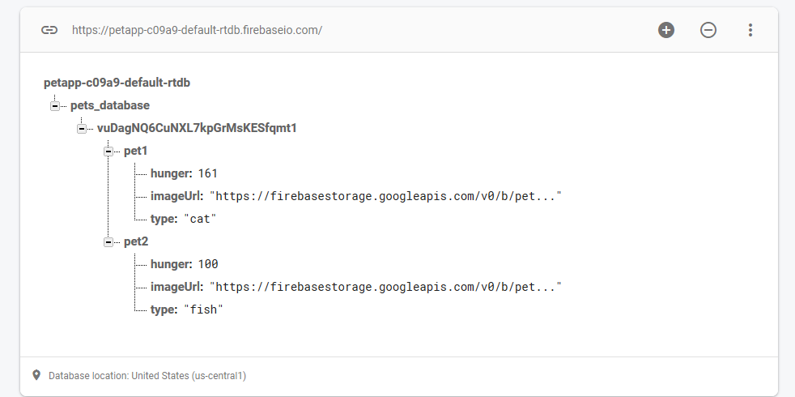

# Day 2: Firebase Storage

So far, we have learnt how to store data such as strings, integers on our Realtime Database. However, what if we wanted to store something a little more complex, such as images? For example, let's say we want to give users the option to change the display image of their pets, and we want these images to be shared across any device they use, how should we go about doing that?

Firebase Storage is a great solution to this problem.

## Creating a Firebase Storage Bucket

1. Go to the Firebase Console Website, and look on the left for **Storage**.




2. Click on **Get Started**, click **Next**, and then select your Cloud Storage Location. Select `asia-southeast2` for the location, and press **Done**. After it is done loading, you should see something like this



3. You now have a Storage Bucket. Right now, our Firebase Storage only allows **Authenticated users** to access this storage. This is okay for us since our users need to be authenticated to use the app.

## Setting up Firebase Storage on our Android app

We'll need to add this line of dependency to the **module-level** `build.gradle` file, under `dependencies`:

```groovy
implementation 'com.google.firebase:firebase-storage'
```

As usual, remember to press **Sync now**

## Overall Flow for our App

Our overall flow we need to add in the Android App will be to:

1. Display an **Image Picker** when the images in `MyPetActivity` are clicked
2. Using the image selected, **upload the image** to a predefined location in Firebase Storage
3. Retrieve the **Image Url** of the uploaded image
4. **Store this Image Url** under our user and corresponding pet in **Firebase Realtime Database**

At the same time, we will also need our App to:

1. Constantly **listen for changes in the Image Url** of the pets
2. **Download the new image** if any image url is changed
3. **Set the ImageView** to our new downloaded image

## Creating an Image Picker

Let's try to make it such that clicking on the pet images in `MyPetActivity` triggers a dialog to open an Image Picker.

1. We will first need to configure our ImageViews in `MyPetActivity` to open a dialog for us to choose an Image to change to. To start off, create an onClickistener for each of other ImageViews, by pasting this code in the `initialiseWidgetsForPets` function.
   
    ```java
    petImage.setOnClickListener(view -> {
        
    });
    ```
2. Then will need to create an **Intent** to select an image. Similar to opening our FirebaseUI, we first need a request code for this intent. In this case actually, we will use **2** request codes to differentiate between the 2 different pets. Copy the following to the top level of our `MyPetActivity` class.

    ```java
    private final static int RC_PICK_IMAGE_1 = 1;
    private final static int RC_PICK_IMAGE_2 = 2;
    ```

3. We will need to modify our `initialiseWidgetsForPet` function to accept a request code as a parameter, so that the function knows which request code to use.

    ```java
    private void initialiseWidgetsForPet(String petId, ImageView petImage,
                                         int imageRC, TextView hungerText,
                                         Button petButton, String pet, int petHungerValue) {
                                        ...
    ```

4. Now we need to actually create the intent. Inside our OnClickListener, copy this

    ```java
    Intent intent = new Intent();
    intent.setType("image/*");
    intent.setAction(Intent.ACTION_GET_CONTENT);
    startActivityForResult(Intent.createChooser(intent, "Select Picture"), imageRC);
    ```

## Uploading a file to Firebase Storage, and getting the URL

1. Once again, we will need to listen for the result of our Image Picker Request, using the `OnActivityResultFunction`, and also check that the result indeed came from the image picker request. In our `MyPetActivity` class, type in the following function:

    ```java
    @Override
    protected void onActivityResult(int requestCode, int resultCode, @Nullable Intent data) {
        super.onActivityResult(requestCode, resultCode, data);

        if (requestCode == RC_PICK_IMAGE_1 || requestCode == RC_PICK_IMAGE_2){
            // more code goes here
        }
    }
    ```

2. We can use an `InputStream` which will eventually help us to upload the image. I will not describe much about the input stream, because it is out of the scope of this workshop.

    > Note: A `try/catch` block is used, since there is a chance the upload will fail

    ```java
    try {
        InputStream inputStream = getContentResolver().openInputStream(data.getData());
        // need to do more work here
    } catch (FileNotFoundException ex) {
    }
    ```

3. We now need to get a reference to our Firebase Storage, and the location we want to put it in. For now, we will put our image under a folder named after our user id. We shall name the image either `1` or `2` depending on which pet it is. Conveniently, this will be the same number as our request code `imageRC`. The syntax to get the references are similar to Firebase Realtime Database.

    ```java
    StorageReference storageRef = FirebaseStorage.getInstance().getReference();
    String userId = FirebaseAuth.getInstance().getCurrentUser().getUid();
    StorageReference userStorageRef = storageRef.child(userId).child(Integer.toString(requestCode));
    ```

    > Warning: Steps 4 to 8 are fairly complex, it's ok if you cant understand

4. Now that we have a reference to where we want to upload our image, we just need to push the stream that we created in Step 6 to our reference. This can be done using  `putStream(stream)` method. This `putStream` method is a task that executes asynchronously (sepearate from the UI).
5. Recall we want to get the download URL for our image as well. While this can be performed by using `userStorageRef.getDownloadUrl()`, this in itself is an **additional side-task** that we must perform and request from Firebase Storage. We can continue from our previous `putStream` task using `continueWithTask(newtask)`.
6. Finally, we need to collect the result of the `getDownloadUrl()` task. This can be done with `addCompleteListener(task -> {})`.
7. After collecting the result, we need to check if the task was successful.
8. If the task was successful, we can get the image URL using `task.getResult().toString()`
9. Now we need to upload the new image URL to the **Firebase Realtime Database**, under **our user** and **the correct pet**. Note that we can get the correct pet by simply combining `"pet"` with the request code value.

    ```java
    userStorageRef.putStream(inputStream) // Step 4
    .continueWithTask(taskSnapshot -> { // Step 5
        return userStorageRef.getDownloadUrl();
    }).addOnCompleteListener(task -> {  // Step 6 
        if (task.isSuccessful()) {  // Step 7
            String imageUrl = task.getResult().toString();  // Step 8
            mUserRef.child("pet" + requestCode)
                .child("imageUrl").setValue(imageUrl); // Step 9
        }
    });
    ```

If you test out now by picking an image (Hint, you can download images on your phone by going to the mobile Chrome Browser), you should be able to see the **image being uploaded to Firebase Storage**, and the **image URL appear in Firebase Realtime Database**.

Storage:


Realtime Database:



## Downloading an Image from Firebase Storage

We now need to get our ImageView to automatically update whenever a new image is uploaded to Firebase Storage. To do that, we need to listen for changes in the `imageUrl` of each pet on **Firebase Realtime Database**.

> Hold up, if we upload a new image to the same directory in our Firebase Storage, won't there be no change in the image URL? The answer is that Firebase Storage actually uploads new images to new storage locations on the Firebase servers, so the image URL will actually change.

1. We need to add a `ValueEventListener` to listen for changes in the `imageUrl` of each pet. To do that, add the following code in the `initialiseWidgetsForPet` function (after the whole block of `petImage.setResource`s)

    ```java
    mUserRef.child(petId).child("imageUrl").addValueEventListener(new ValueEventListener() {
        @Override
        public void onDataChange(@NonNull DataSnapshot snapshot) {
            // need to add more code here
        }

        @Override
        public void onCancelled(@NonNull DatabaseError error) {

        }
    });
    ```

2. For safety, we need to check if the `imageUrl` actually exists, using `snapshot.exists()`
3. At this point, we *just* need to download the image and set it to the ImageView. Unfortunately, this by itself is an extremely tedious task again, because you will need to run the download asynchronously in a way to not cause "hangs" in our UI while downloading. Just copy this `setBitmapFromURL` function which I have written for you to the bottom of your `MyPetActivity` class. It takes in the download url and the image view you want to seet as the parameters, and does all the work for you. You can read the code comments to try understand the code if you want.

    ```java
    private void setBitmapFromURL(String imageString, ImageView imageView) {
        new Thread(() -> {
            // We will need to download the image, on a separate thread/process to avoid hanging our UI
            try {
                // We use try/catch since our download may not succeed
                // First convert the url to a URL type object
                URL imageURL = new URL(imageString);
                // Set up connection to the URL
                HttpURLConnection connection = (HttpURLConnection) imageURL.openConnection();
                // Used to indicate we are using the URL connection for input
                connection.setDoInput(true);
                // Attempt to initiate the connection
                connection.connect();
                // Get an inputstream that will receive our Image
                InputStream inputStream = connection.getInputStream();
                // Convert the bytes received from the stream into a Bitmap
                Bitmap bitmap = BitmapFactory.decodeStream(inputStream);
                // Now that we have our downloading Bitmap, we go back to the thread running the UI
                // so we can finally set the bitmap to the ImageView
                runOnUiThread(() -> imageView.setImageBitmap(bitmap));
            } catch (Exception ex) {
            }
        }).start();
    }
    ```

4. Since I have done all the work writing the function for you, all that's left to do is to extract the imageUrl from the `dataSnapshot` in `onDataChange` and use the function I gave you.

    ```java
    String imageUrlString = snapshot.getValue(String.class);
    setBitmapFromURL(imageUrlString, petImage);
    ```

<details>
  <summary>Final Code for MyPetActivity.java</summary>

```java
package com.example.virtualpets;

import androidx.annotation.NonNull;
import androidx.annotation.Nullable;
import androidx.appcompat.app.AppCompatActivity;

import android.content.Context;
import android.content.Intent;
import android.content.SharedPreferences;
import android.graphics.Bitmap;
import android.graphics.BitmapFactory;
import android.net.Uri;
import android.os.Bundle;
import android.util.Log;
import android.widget.Button;
import android.widget.ImageView;
import android.widget.TextView;

import com.google.android.gms.tasks.Task;
import com.google.firebase.auth.FirebaseAuth;
import com.google.firebase.auth.FirebaseUser;
import com.google.firebase.database.DataSnapshot;
import com.google.firebase.database.DatabaseError;
import com.google.firebase.database.DatabaseReference;
import com.google.firebase.database.FirebaseDatabase;
import com.google.firebase.database.ValueEventListener;
import com.google.firebase.storage.FirebaseStorage;
import com.google.firebase.storage.StorageReference;

import java.io.FileNotFoundException;
import java.io.InputStream;
import java.net.HttpURLConnection;
import java.net.URL;

public class MyPetActivity extends AppCompatActivity {
    DatabaseReference mDatabase;
    DatabaseReference mUserRef;
    private final static int RC_PICK_IMAGE_1 = 1;
    private final static int RC_PICK_IMAGE_2 = 2;

    @Override
    protected void onCreate(Bundle savedInstanceState) {
        super.onCreate(savedInstanceState);
        setContentView(R.layout.activity_my_pet);

        // Set references to widgets in layout file
        ImageView pet1Image = findViewById(R.id.pet1Image);
        TextView pet1HungerText = findViewById(R.id.pet1HungerText);
        Button pet1Button = findViewById(R.id.pet1Button);

        ImageView pet2Image = findViewById(R.id.pet2Image);
        TextView pet2HungerText = findViewById(R.id.pet2HungerText);
        Button pet2Button = findViewById(R.id.pet2Button);

        // Get copy of sharedpreferences
        SharedPreferences sharedPref = getSharedPreferences(getString(R.string.preference_file_key), Context.MODE_PRIVATE);

        // Get Pet1, default to cat
        String pet1 = sharedPref.getString("pet1", "cat");
        int pet1HungerValue = sharedPref.getInt("pet1hunger", 100);

        // Get Pet2, default to dog
        String pet2 = sharedPref.getString("pet2", "dog");
        int pet2HungerValue = sharedPref.getInt("pet2hunger", 100);

        // Get a reference to our Firebase Realtime Database
        mDatabase = FirebaseDatabase.getInstance().getReference();

        // Get our user's email
        String userId = FirebaseAuth.getInstance().getCurrentUser().getUid();

        // Get reference to our user's pet data
        mUserRef = mDatabase.child("pets_database").child(userId);

        mUserRef.child("pet1").child("type").setValue(pet1);
        mUserRef.child("pet1").child("hunger").setValue(pet1HungerValue);
        mUserRef.child("pet2").child("type").setValue(pet2);
        mUserRef.child("pet2").child("hunger").setValue(pet2HungerValue);

        initialiseWidgetsForPet("pet1", pet1Image, RC_PICK_IMAGE_1, pet1HungerText, pet1Button, pet1, pet1HungerValue);
        initialiseWidgetsForPet("pet2", pet2Image, RC_PICK_IMAGE_2, pet2HungerText, pet2Button, pet2, pet2HungerValue);
    }

    private void initialiseWidgetsForPet(String petId, ImageView petImage,
                                         int imageRC, TextView hungerText,
                                         Button petButton, String pet, int petHungerValue) {
        // This function runs for each pet we have

        petImage.setOnClickListener(view -> {
            Intent intent = new Intent();
            intent.setType("image/*");
            intent.setAction(Intent.ACTION_GET_CONTENT);
            startActivityForResult(Intent.createChooser(intent, "Select Picture"), imageRC);
        });

        // Set the image based on which pet it is
        if (pet.equals("cat")) {
            petImage.setImageResource(R.drawable.cat);
        } else if (pet.equals("dog")) {
            petImage.setImageResource(R.drawable.dog);
        } else {    // Else it probably is a fish
            petImage.setImageResource(R.drawable.fish);
        }

        hungerText.setText(Integer.toString(petHungerValue));

        mUserRef.child(petId).child("hunger").addValueEventListener(new ValueEventListener() {
            @Override
            public void onDataChange(@NonNull DataSnapshot snapshot) {
                hungerText.setText(Integer.toString(snapshot.getValue(int.class)));
            }

            @Override
            public void onCancelled(@NonNull DatabaseError error) {

            }
        });

        mUserRef.child(petId).child("imageUrl").addValueEventListener(new ValueEventListener() {
            @Override
            public void onDataChange(@NonNull DataSnapshot snapshot) {
                if (snapshot.exists()) {
                    String imageUrlString = snapshot.getValue(String.class);
                    setBitmapFromURL(imageUrlString, petImage);
                }
            }

            @Override
            public void onCancelled(@NonNull DatabaseError error) {

            }
        });

        // Set onclicklistener to increment hunger by 1 for each button click
        petButton.setOnClickListener(view -> {
            int oldHunger = Integer.parseInt(hungerText.getText().toString());
            hungerText.setText(Integer.toString(oldHunger + 1));
            mUserRef.child(petId).child("hunger").setValue(oldHunger + 1);
        });
    }

    @Override
    protected void onActivityResult(int requestCode, int resultCode, @Nullable Intent data) {
        super.onActivityResult(requestCode, resultCode, data);

        if (requestCode == RC_PICK_IMAGE_1 || requestCode == RC_PICK_IMAGE_2) {
            try {
                InputStream inputStream = getContentResolver().openInputStream(data.getData());
                StorageReference storageRef = FirebaseStorage.getInstance().getReference();
                String userId = FirebaseAuth.getInstance().getCurrentUser().getUid();
                StorageReference userStorageRef = storageRef.child(userId).child(Integer.toString(requestCode));
                userStorageRef.putStream(inputStream)
                    .continueWithTask(taskSnapshot -> {
                        return userStorageRef.getDownloadUrl();
                    }).addOnCompleteListener(task -> {
                        if (task.isSuccessful()) {
                            String imageUrl = task.getResult().toString();
                            mUserRef.child("pet" + requestCode).child("imageUrl").setValue(imageUrl);
                        }
                    });
            } catch (FileNotFoundException ex) {
            }
        }
    }

    /**
     * Generic function to set an ImageView from a given url
     */
    private void setBitmapFromURL(String imageString, ImageView imageView) {
        new Thread(() -> {
            // We will need to download the image, on a separate thread/process to avoid hanging our UI
            try {
                // We use try/catch since our download may not succeed
                // First convert the url to a URL type object
                URL imageURL = new URL(imageString);
                // Set up connection to the URL
                HttpURLConnection connection = (HttpURLConnection) imageURL.openConnection();
                // Used to indicate we are using the URL connection for input
                connection.setDoInput(true);
                // Attempt to initiate the connection
                connection.connect();
                // Get an inputstream that will receive our Image
                InputStream inputStream = connection.getInputStream();
                // Convert the bytes received from the stream into a Bitmap
                Bitmap bitmap = BitmapFactory.decodeStream(inputStream);
                // Now that we have our downloading Bitmap, we go back to the thread running the UI
                // so we can finally set the bitmap to the ImageView
                runOnUiThread(() -> imageView.setImageBitmap(bitmap));
            } catch (Exception ex) {
            }
        }).start();
    }
}
```

</details>

Test out your app now! The images should change when you choose a new image from your image picker!

